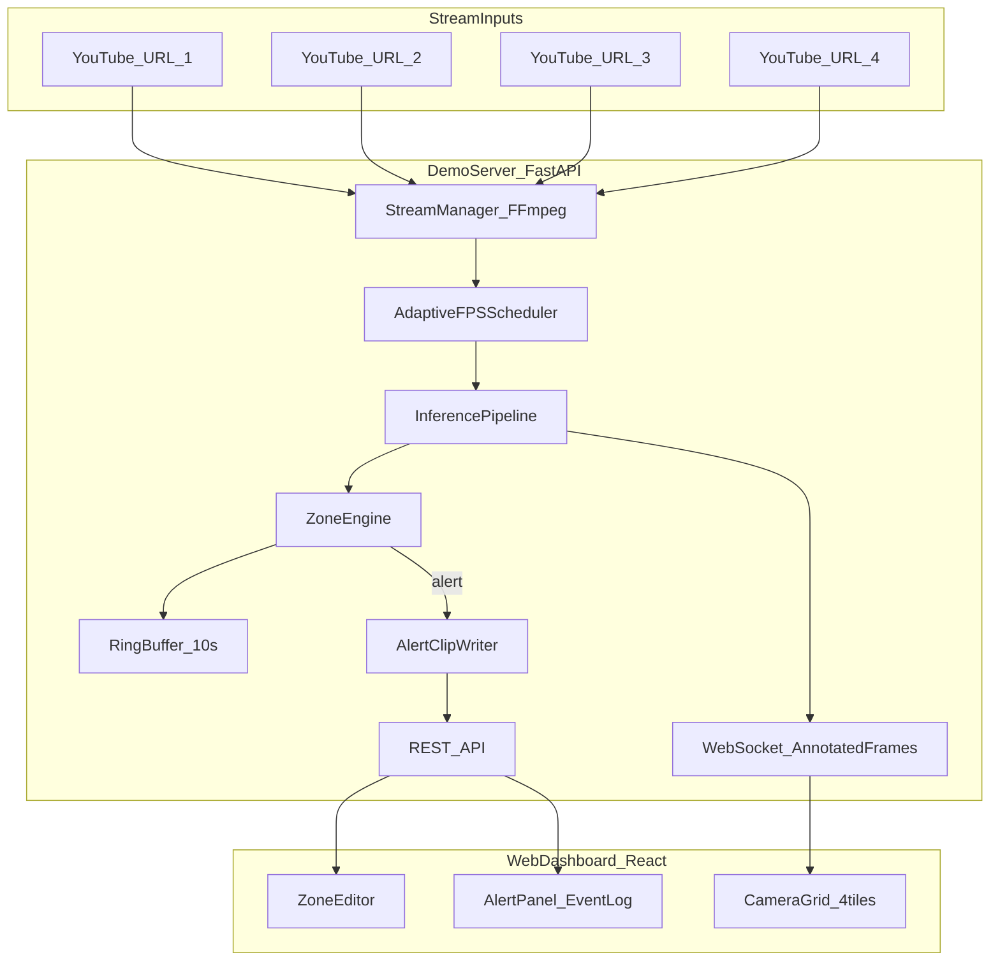

# RapidEye Demo Dashboard Plan

> Isolated demo subproject. Not part of production RapidEye microservices.
> See [README.md](README.md) for setup. This document is the canonical design spec.

## Goals (consolidated)

| Source | Requirement |
|--------|-------------|
| Your feature list | Entity detection, fire detection, weapon recognition, zone alerts |
| Client brief | Client-server architecture; server ingests + infers; web client for live view; 4 feeds; GPU zone logic; judge UX + responsiveness |
| Your decisions | **No installer** (dev on Ubuntu RTX 3090 24GB); **full suite v1**; **4 independent RTSP-like streams**; **`.env` URLs**; **YouTube streams**; **white-label generic UI**; **no auth**; **monorepo folder** `demo-app/` with zero imports from `vision-service/` |

## Non-goals (this phase)

- Windows/Linux installer packaging (deferred)
- Integration with RapidEye microservices (`ingestion-service`, `alert-service`, etc.)
- Production-grade weapon/fire accuracy certification
- Multi-machine LAN deployment

---

## Architecture



**Separation from RapidEye:** `demo-app/` has its own dependencies, config, and runtime data. No shared Python imports from `vision-service/`. Event JSON shapes may *conceptually* align with `vision-service/PLAN.md` `ZoneConfig` polygons but are owned by this demo.

---

## Project layout

```
demo-app/
  PLAN.md                   # this file
  README.md                 # setup, .env, YouTube notes, run commands
  .env.example              # CAMERA_1_URL … CAMERA_4_URL
  .gitignore
  scripts/
    start.sh                # start API + serve/bundle web
    relay_youtube.sh        # optional: yt-dlp → ffmpeg → local RTSP (if needed)
  server/
    main.py                 # FastAPI entry
    config.py               # pydantic-settings from .env
    ingest/stream_manager.py
    ingest/decoder.py         # FFmpeg subprocess / OpenCV capture
    ingest/ring_buffer.py     # per-camera deque for pre-alert video
    inference/pipeline.py
    inference/yolo_runner.py  # Ultralytics wrapper
    inference/zone_engine.py  # point-in-polygon on detection centroids
    inference/scheduler.py    # adaptive FPS allocator
    inference/annotator.py      # draw boxes, labels, zone overlay
    recording/clip_writer.py  # 10s pre + 10s post MP4
    api/routes_zones.py
    api/routes_alerts.py
    api/routes_recordings.py
    api/ws_streams.py
    schemas/                  # AlertEvent, ZoneConfig, Detection
  web/                        # React + Vite + TypeScript
    src/components/CameraGrid.tsx
    src/components/StreamTile.tsx
    src/components/ZoneEditor.tsx
    src/components/AlertPanel.tsx
    src/hooks/useStreamSocket.ts
  data/                       # gitignored at runtime
    models/
    zones/                    # camera_1.json … camera_4.json
    recordings/
```

---

## Stream ingestion (4 independent feeds)

**Config:** `.env` with `CAMERA_1_URL` … `CAMERA_4_URL`.

**YouTube reality:** YouTube is not native RTSP. Ingest layer will use **FFmpeg as universal demuxer**:
- If URL is YouTube: resolve playable URL via `yt-dlp -g` (documented in README; optional helper script).
- If URL is RTSP/HLS/HTTP: pass directly to FFmpeg.
- Each camera runs an **independent decode thread** with its own ring buffer.

**Target:** ~15 FPS annotated output per tile baseline on RTX 3090 @ 1080p, with headroom for 4 concurrent streams.

---

## Adaptive FPS scheduler (dynamic requirement)

Baseline **15 FPS process budget** per camera (60 FPS total cap before GPU saturation).

| Camera state | FPS adjustment |
|--------------|----------------|
| No detections in last N frames | **Increase** priority — steal budget from quiet peers (up to ~20–25 FPS) |
| Active detections (entity/fire/weapon) or zone alert | **Decrease** FPS — maintain tracking with fewer frames (down to ~8–10 FPS) |
| Global GPU saturated | Scheduler normalizes so sum of per-stream FPS ≤ GPU budget |

Implementation in `server/inference/scheduler.py`:
- Track per-stream `last_detection_ts`, `current_fps`, `target_fps`.
- Rebalance every 500ms based on detection activity.
- Log scheduler decisions to server logs for tuning on 3090.

---

## CV pipeline (YOLO-multi, full suite)

Single shared GPU inference path per tick (optionally **batched across streams** when frames align) to maximize 3090 utilization.

| Task | Model approach | Classes / notes |
|------|----------------|-----------------|
| **Entity detection** | YOLO11 (`yolo11m.pt` or `yolo11s.pt`) | COCO: person, vehicle, animal, etc. |
| **Fire detection** | Fine-tuned YOLO weights (fire/smoke dataset; e.g. Roboflow/HuggingFace community weights) | `fire`, `smoke` |
| **Weapon detection** | Fine-tuned YOLO weights (weapon/knife dataset) | `handgun`, `rifle`, `pistol`, `knife`, etc. (map to dataset labels) |
| **Zone intrusion** | Geometry on detection centroids | Alert when **person OR any entity class** enters per-camera polygon |

**Orchestration** (`server/inference/pipeline.py`):
1. Run entity YOLO on frame.
2. Run fire + weapon models on same frame (separate weights initially — simplest path to full suite; merge into unified result list).
3. Filter by confidence thresholds (configurable in `.env` / `config.yaml`).
4. Pass detections to zone engine.
5. Annotate frame; emit detections + alerts.

**Performance notes (CV):**
- Start PyTorch/Ultralytics on 3090; add **TensorRT/ONNX export** only if 4×1080p cannot hold 15 FPS baseline.
- Weapon/fire community models vary in quality — README will document expected false-positive rate for demo purposes.

---

## Zone management (UI + server)

- **One polygon zone per camera** (4 zones max).
- **Zone editor:** select camera tile → draw polygon on frozen snapshot → save normalized coordinates `[0,1]` to `data/zones/camera_{n}.json`.
- **API:** `GET/PUT /api/zones/{camera_id}`.
- **Alert rule:** any detection centroid inside polygon where class ∈ configured entity set (person, vehicle, etc.) OR fire/weapon class → `zone.intrusion` or typed alert (`fire.detected`, `weapon.detected`).
- Overlay zone polygon on annotated stream (green idle / red on alert).

---

## Alerts and recording

| Item | Behavior |
|------|----------|
| **Alert UX** | In-dashboard only: banner, per-tile highlight, scrollable event log |
| **Alert types** | `zone.intrusion`, `fire.detected`, `weapon.detected`, `entity.detected` (optional info) |
| **Recording** | Per-camera **ring buffer** (~10s); on alert write **10s pre + 10s post** MP4 to `data/recordings/{alert_id}.mp4` |
| **Playback** | `GET /api/recordings/{alert_id}` + inline player in event log |

---

## Web dashboard (white-label generic)

**Stack:** React + Vite + TypeScript + Tailwind (fast to build, easy to serve from FastAPI).

**Screens:**
1. **Live grid** — 2×2 camera tiles, annotated video via WebSocket (JPEG binary or base64 + JSON metadata side channel).
2. **Zone editor** — modal/side panel per camera.
3. **Alerts panel** — chronological events with camera id, type, confidence, timestamp, clip link.

**Branding:** Generic title ("Security Monitor" / "Vision Demo") — no RapidEye logo.

**Responsiveness goal:** Annotated tile updates feel live (≥10 FPS perceived minimum; target 15 FPS baseline). Show per-tile FPS + inference latency overlay (dev toggle) to demonstrate GPU pipeline health to client.

---

## API surface (minimal)

| Endpoint | Purpose |
|----------|---------|
| `WS /ws/streams/{camera_id}` | Annotated frames + detection payload |
| `GET /api/health` | GPU available, models loaded, stream status |
| `GET/PUT /api/zones/{camera_id}` | Zone polygon CRUD |
| `GET /api/alerts` | Paginated alert history |
| `GET /api/recordings/{alert_id}` | Download alert clip |
| `GET /api/streams/status` | Per-stream FPS, decode errors, URL masked |

---

## Dev environment

| Component | Choice |
|-----------|--------|
| OS | Ubuntu 22.04+ |
| GPU | RTX 3090 24GB, CUDA 12.x |
| Python | 3.10+, FastAPI, Ultralytics, OpenCV, ffmpeg, yt-dlp |
| Node | 20+ for web build |
| Run | `./scripts/start.sh` → API on `:8000`, web on `:5173` (dev) or static from API (prod-like) |

---

## Implementation phases

### Phase 1 — Skeleton + 4 live tiles (2–3 days)
- `.env` ingest, FFmpeg decode, WebSocket JPEG push
- React 2×2 grid with per-tile FPS overlay
- Health endpoint + stream status

### Phase 2 — Entity detection + zones (2–3 days)
- YOLO entity model on GPU
- Zone editor UI + polygon storage
- Zone intrusion alerts (person/entity) in event log

### Phase 3 — Fire + weapon models (2–3 days)
- Wire fire/weapon YOLO weights
- Typed alerts + annotated labels (color-coded: fire=orange, weapon=red)
- Confidence tuning on YouTube test streams

### Phase 4 — Adaptive FPS + alert recording (2 days)
- Scheduler rebalance logic
- 10s ring buffer + alert MP4 clips
- Recording playback in UI

### Phase 5 — Polish for client demo (1–2 days)
- Generic branding pass
- README with runbook for swapping YouTube URLs
- Demo script: expected alerts, tuning knobs, known limitations

**Total estimate:** ~10–13 dev days for full suite on RTX 3090 (no installer).

---

## Risks and mitigations

| Risk | Mitigation |
|------|------------|
| YouTube URL breakage / ToS | README documents rotation; support any FFmpeg-readable URL; optional local MP4 loop |
| 4×1080p exceeds 15 FPS | Adaptive scheduler; downscale to 720p for processing (keep aspect); TensorRT export |
| Weapon/fire model false positives | Separate confidence thresholds; debounce alerts (e.g. 2-of-3 frames) |
| Low dashboard FPS | WebSocket JPEG quality/size tuning; only send on new frame; hardware decode via NVDEC |
| Scope creep toward RapidEye | Strict `demo-app/` boundary; no shared code with `vision-service/benchmarks/` |

---

## Future path (out of scope, but designed for)

When client wants self-deploy installer: wrap same server+web in Docker Compose or PyInstaller + embedded static web; add GPU check script. Event schemas can later be mapped to RapidEye `vision.detection` / `vision.action` bus messages without rewriting the demo UI.
