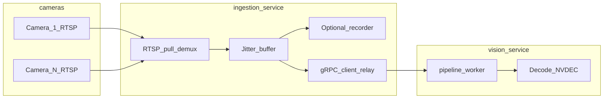
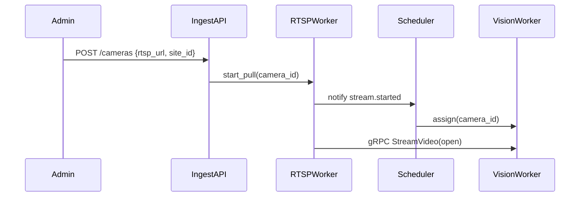

# Ingestion Service — Design Plan

Canonical design document for RapidEye's video ingestion microservice. This service is the **sole owner of camera connectivity**: it pulls RTSP from IP cameras, optionally records encoded streams, and relays **encoded video bytes** to [vision-service](../vision-service) over **gRPC streams**. It does **not** decode video for the CV pipeline.

See also: [vision-service/PLAN.md](../vision-service/PLAN.md) (decode, CV pipeline, and `VideoIngress` server).

---

## Table of Contents

1. [Executive Summary & Service Boundaries](#1-executive-summary--service-boundaries)
2. [System Architecture](#2-system-architecture)
3. [RTSP Ingest](#3-rtsp-ingest)
4. [Encoded Video Relay (gRPC)](#4-encoded-video-relay-grpc)
5. [Stream Lifecycle & Scheduling](#5-stream-lifecycle--scheduling)
6. [Recording (Optional)](#6-recording-optional)
7. [APIs & Integration Points](#7-apis--integration-points)
8. [Deployment & Scaling](#8-deployment--scaling)
9. [Observability](#9-observability)
10. [Phased Delivery Milestones](#10-phased-delivery-milestones)
11. [Open Decisions & Risks](#11-open-decisions--risks)

---

## 1. Executive Summary & Service Boundaries

### Role

ingestion-service is the **media plane entry point** for RapidEye. It maintains persistent RTSP connections to cameras, normalizes encoded output, and fans out encoded chunks to assigned vision-workers. It shields vision-service from camera-specific protocols, reconnect logic, and credential management.

### Confirmed Requirements (aligned with vision-service)

| Dimension | Decision |
|-----------|----------|
| Camera protocol | RTSP (ONVIF discovery optional) |
| Relay format | Encoded H.264 / H.265 NAL units (no decoded frames) |
| Transport to vision | gRPC bidirectional stream (`VideoIngress.StreamVideo`) |
| Decode location | vision-service only |
| Scale | Horizontal sharding by camera; 20–40 RTSP pulls per pod (target) |
| Security | mTLS on gRPC; camera credentials in secrets store |

### In Scope

- RTSP pull, reconnect, jitter buffering
- Encoded passthrough (preferred) or transcode when required
- Per-camera gRPC relay to vision-worker
- Backpressure handling from vision-worker
- Stream lifecycle events on bus (`stream.started`, `stream.stopped`, `stream.error`)
- Optional encoded recording to object storage

### Out of Scope (Delegated)

| Concern | Owner Service |
|---------|---------------|
| Video decode, CV inference | [vision-service](../vision-service) |
| Perception events, gallery | [vision-service](../vision-service) |
| Access / attendance / alerts | Downstream consumers of vision events |
| Site admin, camera provisioning UI | [admin-service](../admin-service) |

### High-Level Data Flow



---

## 2. System Architecture

### Runtime Components

| Component | Responsibility |
|-----------|----------------|
| `ingest-api` | FastAPI: camera registration, stream control, health |
| `rtsp-worker` | Per-pod RTSP pull + demux; emits NAL units |
| `relay-agent` | gRPC client: opens `StreamVideo` per camera to assigned vision-worker |
| `scheduler-client` | Queries vision stream-scheduler for worker assignment |
| `recorder` (optional) | Writes encoded stream to S3/MinIO without re-decode |

### Design Principles

| Principle | Rationale |
|-----------|-----------|
| **Single RTSP connection per camera** | Cameras limit concurrent pulls; vision never connects to RTSP in production |
| **Encoded passthrough** | Copy NAL units from RTSP demux when codec is compatible — no generation loss |
| **One gRPC stream per camera** | Isolates backpressure; avoids head-of-line blocking |
| **Bounded buffers** | Unbounded buffering causes stale frames and OOM under worker slowdown |

### Technology Stack

| Layer | Choice |
|-------|--------|
| API | FastAPI + Pydantic v2 |
| RTSP / demux | FFmpeg (libavformat) or GStreamer |
| gRPC | `grpcio` + shared `proto/rapideye/video/v1/video.proto` |
| Coordination | Redis or NATS KV (camera → worker mapping cache) |
| Secrets | Vault / K8s secrets for RTSP credentials |
| Container | CPU-optimized image (no GPU required) |

---

## 3. RTSP Ingest

### 3.1 Purpose

Maintain a reliable, low-latency encoded byte stream per registered camera.

### 3.2 Processing Pipeline

```
register_camera(rtsp_url, credentials)
  → open RTSP (TCP preferred)
  → demux video track
  → if codec in {h264, hevc} and profile compatible:
        passthrough NAL units
    else:
        transcode to h264 (last resort; adds CPU load)
  → push to jitter buffer
  → relay-agent + optional recorder
```

### 3.3 Reconnect Behavior

| Event | Action |
|-------|--------|
| RTSP disconnect | Exponential backoff reconnect (1s → 30s cap) |
| Reconnect success | Resume NAL relay; emit `stream.started` if was down |
| Auth failure | Emit `stream.error`; do not retry without credential update |
| Prolonged outage | Emit `stream.stopped`; alert ops |

### 3.4 Configuration

| Parameter | Default | Description |
|-----------|---------|-------------|
| `rtsp.transport` | `tcp` | `tcp` or `udp` |
| `rtsp.reconnect_max_backoff_s` | `30` | Max reconnect wait |
| `rtsp.jitter_buffer_ms` | `200` | Demux jitter buffer |
| `rtsp.preferred_codecs` | `["h264", "hevc"]` | Passthrough preference |
| `rtsp.max_cameras_per_pod` | `40` | Shard threshold |

---

## 4. Encoded Video Relay (gRPC)

### 4.1 Contract

Canonical protobuf is defined in [vision-service PLAN.md — Video Ingress Contract](../vision-service/PLAN.md#video-ingress-contract-grpc) and lives at `proto/rapideye/video/v1/video.proto` (monorepo shared).

**ingestion-service role:** gRPC **client**  
**vision-service role:** gRPC **server** (`VideoIngress` on each `pipeline-worker`)

### 4.2 Relay Pipeline

```
for each camera assignment:
    worker_addr = scheduler.resolve(camera_id)
    stream = grpc_client.StreamVideo(worker_addr)

    for nal_unit in jitter_buffer.pop():
        chunk = EncodedVideoChunk{
            stream_id, camera_id, site_id,
            pts_us, sequence, payload=nal_unit,
            codec, keyframe, width, height
        }
        stream.send(chunk)

        control = stream.recv(timeout=100ms)
        if control.backpressure == SLOW_DOWN:
            drop_non_keyframes_until_caught_up()
        if control.backpressure == PAUSE:
            pause_send(max_buffer_ms=500)
```

### 4.3 Backpressure Handling

| `BackpressureSignal` | ingestion-service response |
|----------------------|----------------------------|
| `OK` | Continue at camera rate |
| `SLOW_DOWN` | Drop non-keyframes; cap buffer at `relay.max_buffer_ms` |
| `PAUSE` | Stop sending; buffer up to `relay.pause_buffer_ms` then drop oldest |

**Never** unbound the encoded chunk queue. Stale frames harm CV more than dropped frames.

### 4.4 Security

- mTLS between ingestion pods and vision-worker pods (cluster-internal CA).
- `EncodedVideoChunk` carries no credentials.
- RTSP URLs and credentials stored only in ingestion-service secrets.

---

## 5. Stream Lifecycle & Scheduling

### 5.1 Registration Flow



### 5.2 Worker Rebalance

When vision stream-scheduler reassigns a camera:

1. Open new `StreamVideo` to target worker.
2. Send keyframe-first on new stream.
3. Overlap window (2–5 s) optional dual-relay.
4. Close old gRPC stream.
5. Emit `stream.reassigned` on bus.

### 5.3 Bus Events (published by ingestion-service)

| Event | Payload highlights |
|-------|-------------------|
| `ingestion.stream.started` | `camera_id`, `stream_id`, `site_id`, `codec` |
| `ingestion.stream.stopped` | `camera_id`, `reason` |
| `ingestion.stream.error` | `camera_id`, `error_code`, `message` |
| `ingestion.stream.reassigned` | `camera_id`, `old_worker_id`, `new_worker_id` |

---

## 6. Recording (Optional)

Record **encoded** streams (same NAL units relayed to vision) to object storage for investigation / clipping-service.

| Approach | Notes |
|----------|-------|
| Encoded passthrough to `.mp4`/fMP4 | No decode; low CPU |
| Segment length | 2–10 min fragments; S3 multipart upload |
| Retention | Policy from admin-service |

Recording is independent of the gRPC relay path — tee from jitter buffer.

---

## 7. APIs & Integration Points

### 7.1 Ingestion API

| Method | Path | Description |
|--------|------|-------------|
| `POST` | `/cameras` | Register camera: `rtsp_url`, `site_id`, credentials ref |
| `DELETE` | `/cameras/{camera_id}` | Stop pull and close gRPC relay |
| `PATCH` | `/cameras/{camera_id}` | Update credentials, enable/disable |
| `GET` | `/cameras` | List cameras with status (`live`, `reconnecting`, `error`) |
| `GET` | `/cameras/{camera_id}/stats` | Bitrate, fps, reconnect count, buffer depth |
| `GET` | `/health` | Liveness |
| `GET` | `/ready` | At least one successful RTSP probe path |

### 7.2 Integration with vision-service

| Direction | Mechanism |
|-----------|-----------|
| ingestion → vision | gRPC `VideoIngress.StreamVideo` (encoded chunks) |
| ingestion → vision | Bus: `stream.started` / `stopped` / `error` |
| vision → ingestion | gRPC `StreamControl` (ack, backpressure) |
| admin → both | Camera registration in ingestion; zone config in vision `POST /streams` |

---

## 8. Deployment & Scaling

### 8.1 Pod Sizing (CPU)

| Resource | Per pod (target) |
|----------|------------------|
| CPU | 4–8 cores |
| RAM | 4–8 GB |
| Network | 1 Gbps+ (50 cameras @ 3 Mbps ≈ 150 Mbps) |
| Cameras | 20–40 RTSP pulls |

No GPU required on ingestion pods.

### 8.2 Horizontal Scaling

```
total_cameras / cameras_per_pod = ingestion_replicas
```

Shard by `site_id` or consistent hash on `camera_id`. Scheduler coordinates which vision-worker receives each camera's gRPC stream.

### 8.3 Capacity Notes

| Bottleneck | Typical limit |
|------------|---------------|
| RTSP connections | 20–40 per pod (camera vendor dependent) |
| CPU transcode | Avoid; passthrough only when possible |
| Egress to vision cluster | ~3 Mbps × camera count |
| gRPC streams | 1 per camera; HTTP/2 handles hundreds per pod |

Inference on vision GPUs is the system bottleneck — not gRPC relay.

---

## 9. Observability

| Metric | Type | Description |
|--------|------|-------------|
| `ingestion_rtsp_connected` | Gauge | Cameras with live RTSP |
| `ingestion_rtsp_reconnect_total` | Counter | Reconnect attempts |
| `ingestion_relay_bytes_sent` | Counter | Bytes sent per camera |
| `ingestion_relay_buffer_depth` | Gauge | Chunks queued per camera |
| `ingestion_backpressure_received_total` | Counter | By level |
| `ingestion_keyframes_dropped_total` | Counter | Under backpressure |
| `ingestion_grpc_stream_errors_total` | Counter | gRPC failures |

Structured logs: `camera_id`, `stream_id`, `worker_id`, `sequence`, `keyframe`.

---

## 10. Phased Delivery Milestones

| Phase | Deliverables | Exit Criteria |
|-------|--------------|---------------|
| **I0** | RTSP pull + local health | 1 camera stable for 24 h |
| **I1** | gRPC relay to vision M0/M1 worker | vision receives decodable chunks; acks received |
| **I2** | Backpressure + bounded buffers | No OOM under simulated slow worker |
| **I3** | Multi-camera pod + scheduler integration | 20 cameras on 1 ingestion pod |
| **I4** | Optional encoded recording | fMP4 segments in object storage |

---

## 11. Open Decisions & Risks

### Open Decisions

| Decision | Options | Recommendation |
|----------|---------|----------------|
| Demux library | FFmpeg vs GStreamer | FFmpeg for team familiarity; GStreamer if pipeline grows |
| Transcode policy | Reject vs transcode unsupported codec | Transcode to H.264 only when required; alert ops |
| Dual relay on rebalance | Overlap vs hard cut | 2–5 s overlap to avoid perception gap |

### Risks

| Risk | Mitigation |
|------|------------|
| Camera connection limits | Shard pulls; never duplicate RTSP from vision |
| Unbounded buffer on slow worker | Backpressure + keyframe drop + max buffer ms |
| Credential leakage | Secrets store only; never log RTSP URLs with credentials |
| Stale video under load | Drop old chunks; prefer live over complete |

---

## Appendix: Shared Protobuf Location

```
proto/
└── rapideye/
    └── video/
        └── v1/
            └── video.proto    # VideoIngress, EncodedVideoChunk, StreamControl
```

Both services generate stubs from this single source. CI contract tests verify chunk round-trip: ingestion encode fixture → vision decode → frame hash.
