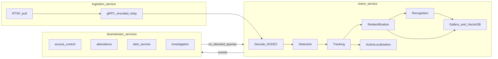
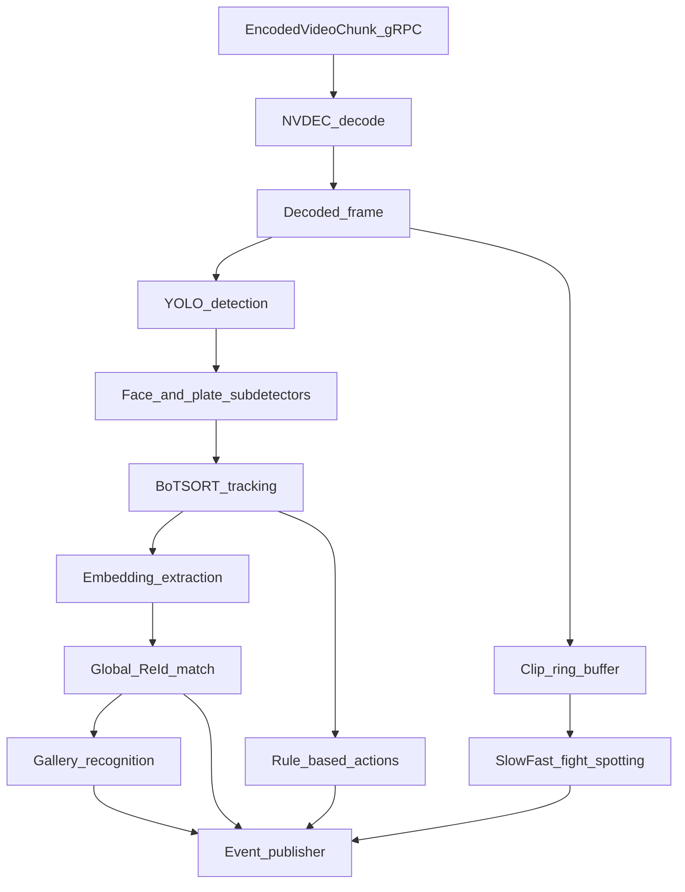
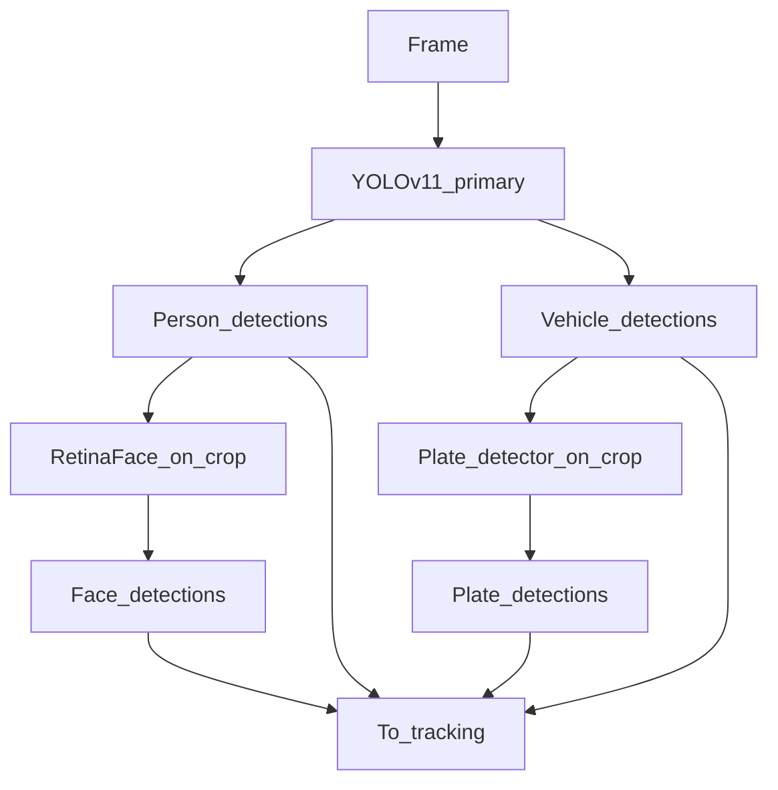
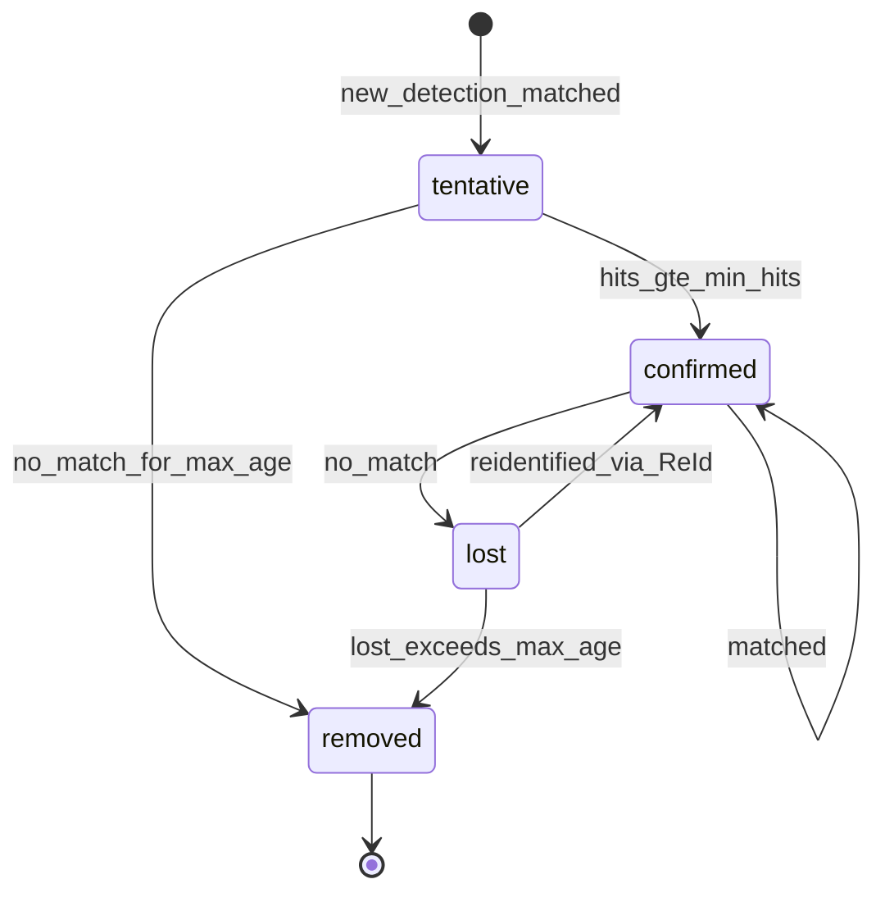
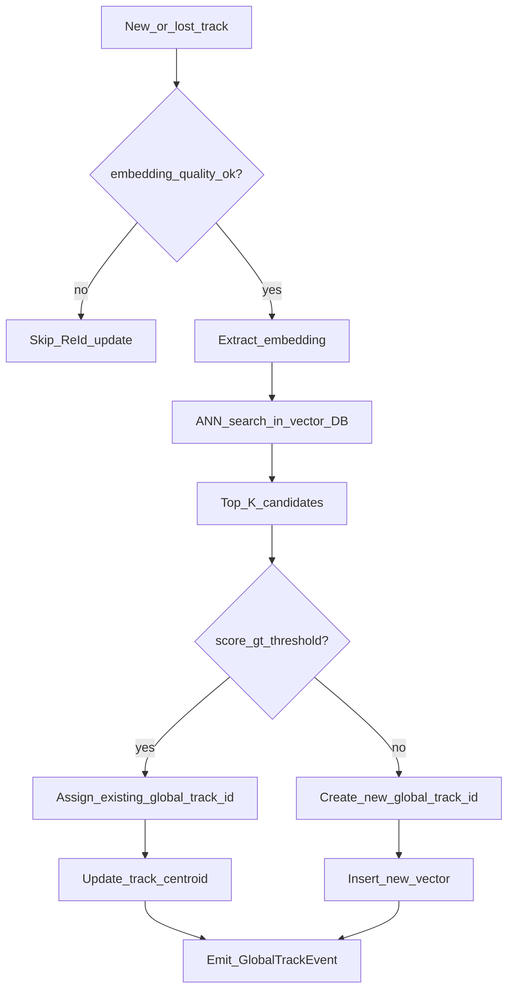
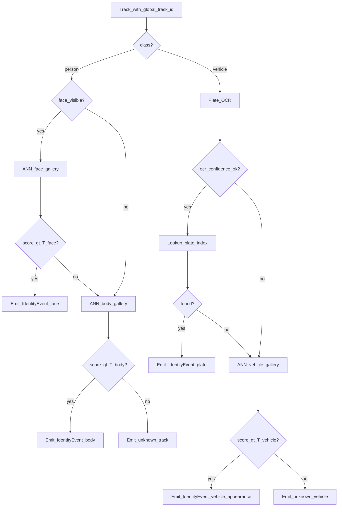
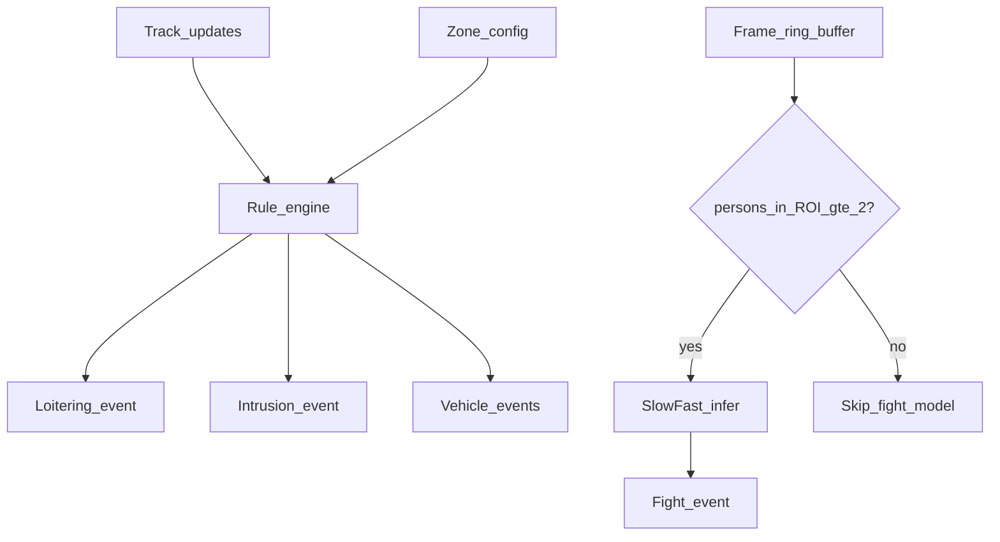
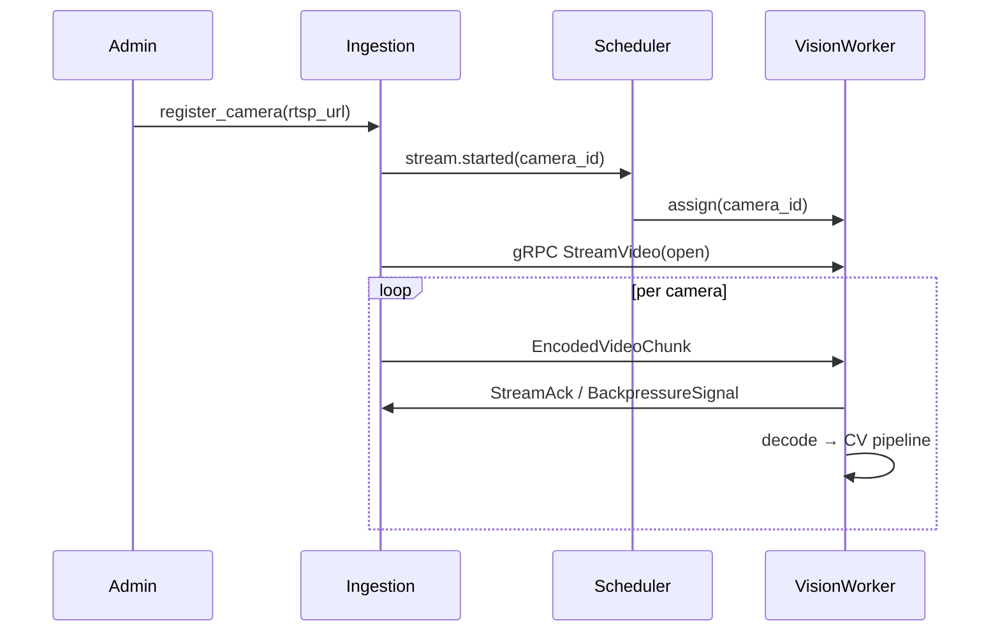

# Vision Service — Design Plan

Canonical design document for RapidEye's computer-vision microservice. This service receives **encoded video** from [ingestion-service](../ingestion-service) over **gRPC streams**, decodes locally, and runs a multi-stage CV pipeline for **person (body), face, and vehicle** entities. It exposes **hybrid integration**: async event publishing for live use cases plus sync APIs for investigation and gallery management.

---

## Table of Contents

1. [Executive Summary & Service Boundaries](#1-executive-summary--service-boundaries)
2. [System Architecture](#2-system-architecture)
3. [Entity Detection](#3-entity-detection)
4. [Entity Tracking](#4-entity-tracking)
5. [Entity Re-Identification (ReId)](#5-entity-re-identification-reid)
6. [Entity Recognition](#6-entity-recognition)
7. [Action Localization / Spotting](#7-action-localization--spotting)
8. [Data Models & Event Contracts](#8-data-models--event-contracts)
9. [APIs & Integration Points](#9-apis--integration-points)
10. [Storage Layout](#10-storage-layout)
11. [Deployment & Operations](#11-deployment--operations)
12. [Phased Delivery Milestones](#12-phased-delivery-milestones)
13. [Open Decisions & Risks](#13-open-decisions--risks)

---

## 1. Executive Summary & Service Boundaries

### Role

vision-service is the **real-time perception layer** for RapidEye. It converts raw video frames into structured entity events: detections, tracks, global identities, recognized persons/vehicles, and action alerts. Downstream services apply business policy; vision-service does not decide access grants, attendance records, or alert routing.

### Confirmed Requirements

| Dimension | Decision |
|-----------|----------|
| Use cases | Access control, attendance, investigation, alerts, analytics |
| Input | Encoded video (H.264/H.265) via gRPC from ingestion-service; decoded in vision-worker |
| Integration | Hybrid (event bus + on-demand RPC) |
| Entities | Person body, face, vehicle |
| Throughput | Mid-tier GPU, ~15–25 FPS per stream |
| Cross-camera | Global ReId across all cameras |
| Actions (MVP) | Intrusion, loitering, fight, vehicle events |
| Recognition | Face primary (InsightFace / ArcFace), body ReID fallback |
| Vehicle ID | License plate OCR + optional appearance ReID |
| Gallery owner | vision-service |
| Embedding store | Milvus or Qdrant |
| Stack | Python, FastAPI, PyTorch / ONNX Runtime |
| Scale | Horizontal scaling from day one |

### In Scope

- Entity detection (YOLO + sub-detectors)
- Encoded video ingress (gRPC), local decode (NVDEC), and frame dispatch
- Entity tracking (SORT-family algorithms)
- Entity re-identification (cross-frame and cross-camera)
- Entity recognition (gallery matching for persons and vehicles)
- Action localization / spotting (MVP action set)
- Gallery management and embedding search APIs
- Stream registration and investigation query APIs

### Out of Scope (Delegated)

| Concern | Owner Service |
|---------|---------------|
| RTSP pull, encoded relay, recording | [ingestion-service](../ingestion-service) |
| Access policy, allow/deny decisions | [access-control-service](../access-control-service) |
| Attendance records, shift rules | [attendance-service](../attendance-service) |
| Alert routing, escalation, notifications | [alert-service](../alert-service) |
| Case management, forensic UI | [investigation-service](../investigation-service) |
| Site/tenant admin, GDPR policy | [admin-service](../admin-service) |

### ReId vs Recognition

These terms are used consistently throughout this document:

| Term | Meaning |
|------|---------|
| **Re-Identification (ReId)** | Anonymous track continuity — linking the same *unknown* entity across occlusions, re-entries, and cameras via appearance embeddings. Produces a `global_track_id`. |
| **Recognition** | Matching a track against an **enrolled gallery** of known identities. Produces an `identity_id` (person) or `vehicle_identity_id` (vehicle). |

A track can have a `global_track_id` without a recognized `identity_id` (unknown person). Recognition always operates on top of tracking/ReId.

### High-Level Data Flow



---

## 2. System Architecture

### Runtime Components

| Component | Entrypoint | Responsibility |
|-----------|------------|----------------|
| `api` | `uvicorn vision.api:app` | FastAPI: gallery CRUD, stream registration, investigation queries, health |
| `pipeline-worker` | `python -m vision.worker` | Per-GPU worker: decode → CV stages → publish events |
| `stream-scheduler` | `python -m vision.scheduler` | Assigns camera streams to workers; rebalances on scale-out |
| `embedding-service` | Internal module | Milvus/Qdrant read/write, ANN search, gallery sync |
| `video-ingress` | Internal gRPC server (on worker) | Receives `EncodedVideoChunk` streams; exposes backpressure signals |

| `event-publisher` | Internal module | Publishes typed events to message bus |

### Processing Model

1. **ingestion-service** pulls RTSP from cameras and relays **encoded** NAL units to the assigned `pipeline-worker` over a **per-camera gRPC stream** (see [Video Ingress Contract](#video-ingress-contract-grpc)). vision-service **decodes locally** — ingestion never sends decoded frames in production.
2. Each worker runs an **async pipeline per stream** (or batches N streams when models support batched inference).
3. A **frame ring buffer** (32–64 frames) runs in parallel with the main loop, feeding action localization without blocking the detection target FPS.
4. **ONNX Runtime** (or TensorRT) serves production inference. PyTorch is reserved for training, fine-tuning, and export only.
5. **M0 bootstrap exception:** workers may pull RTSP directly for local development; production path is always encoded gRPC from ingestion-service.

### Video Ingress Contract (gRPC)

vision-service is the **gRPC server** for video ingress. ingestion-service opens one long-lived client stream per camera → assigned worker.

**Design principles**

| Principle | Rationale |
|-----------|-----------|
| Encoded bytes only | ~200–400× less bandwidth than raw BGR frames |
| Decode in vision-worker | Colocate NVDEC with GPU inference; avoid double-decode in ingestion |
| One stream per camera | Avoid head-of-line blocking across cameras |
| Backpressure | Worker signals slow consumption; ingestion drops or pauses non-critical chunks |
| mTLS | Surveillance video is PII-tier data in transit |

**Protobuf service** (canonical contract; shared with [ingestion-service/PLAN.md](../ingestion-service/PLAN.md)):

```protobuf
syntax = "proto3";

package rapideye.video.v1;

service VideoIngress {
  // ingestion-service (client) → vision-worker (server)
  // One RPC per camera; stream stays open for the life of the assignment.
  rpc StreamVideo(stream EncodedVideoChunk) returns (stream StreamControl);
}

message EncodedVideoChunk {
  string stream_id = 1;
  string camera_id = 2;
  string site_id = 3;
  int64 pts_us = 4;           // presentation timestamp (microseconds)
  int64 dts_us = 5;           // decode timestamp (optional)
  uint32 sequence = 6;        // monotonic per stream
  bytes payload = 7;          // Annex-B or AVCC NAL unit(s)
  string codec = 8;           // "h264" | "hevc"
  bool keyframe = 9;
  uint32 width = 10;          // from SPS; 0 until known
  uint32 height = 11;
  map<string, string> metadata = 12;
}

message StreamControl {
  oneof command {
    StreamAck ack = 1;
    BackpressureSignal backpressure = 2;
  }
}

message StreamAck {
  uint32 last_sequence = 1;
  int64 processed_pts_us = 2;
}

message BackpressureSignal {
  enum Level {
    OK = 0;
    SLOW_DOWN = 1;    // ingestion should reduce send rate / drop non-keyframes
    PAUSE = 2;        // stop sending until RESUME ack
  }
  Level level = 3;
  string reason = 4;
}
```

**Decode path in pipeline-worker:**

```
EncodedVideoChunk → jitter buffer → NVDEC / PyAV decode → BGR frame + pts
→ frame ring buffer + detection loop
```

**Backpressure behavior**

| Worker signal | ingestion-service action | vision-worker action |
|---------------|--------------------------|----------------------|
| `OK` | Send at camera rate | Process all keyframes + selected deltas |
| `SLOW_DOWN` | Drop non-keyframes if behind | Skip decode of non-keyframes; protect FPS budget |
| `PAUSE` | Buffer up to `max_buffer_ms` then drop | Drain inference queue; resume when backlog < threshold |

**End-to-end latency SLO (v1):** p99 frame age (camera PTS → `DetectionEvent`) **< 500 ms** under nominal load.

**Bandwidth estimate:** 1080p H.264 @ 20 FPS ≈ 2–4 Mbps per camera. 50 cameras ≈ 100–200 Mbps cluster ingress — manageable; inference remains the bottleneck, not gRPC.

### Horizontal Scaling

Stream count per deployment is TBD; the architecture assumes scale-out from day one:

- **Stateless workers** — no gallery data on GPU nodes; workers can be added/removed freely.
- **Centralized vector DB** — Milvus or Qdrant holds all embeddings; workers are pure compute.
- **Redis** (or NATS KV) — ephemeral per-stream track cache, worker heartbeats, stream-to-worker assignment.
- **Stream scheduler** — on worker join/leave, reassigns streams with minimal disruption (graceful handoff with overlap window).

### Pipeline Stage Ordering



### Technology Stack

| Layer | Choice |
|-------|--------|
| API framework | FastAPI + Pydantic v2 |
| Inference | ONNX Runtime GPU (TensorRT optional) |
| Training / export | PyTorch |
| Vector search | Milvus or Qdrant |
| Metadata DB | PostgreSQL |
| Cache / coordination | Redis |
| Object storage | S3-compatible (MinIO) |
| Message bus | Kafka or NATS JetStream (TBD) |
| Video ingress | gRPC (`rapideye.video.v1.VideoIngress`) with mTLS |
| Decode | NVDEC (primary) / PyAV+ffmpeg (fallback) |
| Container | CUDA base image (12.x), multi-stage build |

---

## 3. Entity Detection

### 3.1 Purpose & Scope

Produce per-frame bounding boxes and class labels for **person**, **face**, and **vehicle** entities. Detection is the first stage of the pipeline and must sustain the global FPS budget (~15–25 FPS per stream on mid-tier GPU).

Face and plate detection run as **secondary stages** on crops from primary detections to balance accuracy and throughput.

### 3.2 Inputs / Outputs

**Inputs**

| Field | Type | Description |
|-------|------|-------------|
| `frame` | `np.ndarray` | BGR image, decoded locally from `EncodedVideoChunk` (Section 2) |
| `stream_id` | `UUID` | Registered stream identifier |
| `camera_id` | `string` | Physical camera reference |
| `frame_ts` | `datetime` | Frame timestamp from chunk `pts_us` (UTC) |
| `frame_index` | `int` | Monotonic index within stream (from chunk `sequence`) |

**Outputs** — `Detection` record per bounding box:

```json
{
  "detection_id": "uuid",
  "stream_id": "uuid",
  "camera_id": "string",
  "frame_ts": "2026-07-01T12:00:00.000Z",
  "frame_index": 1042,
  "bbox": { "x1": 120, "y1": 80, "x2": 340, "y2": 520 },
  "class": "person",
  "confidence": 0.91,
  "crop_ref": "s3://bucket/crops/{detection_id}.jpg"
}
```

`class` enum: `person` | `vehicle` | `face` | `license_plate`

### 3.3 Model & Library Choices

| Stage | Model | Rationale |
|-------|-------|-----------|
| Primary detection | **YOLOv11** (fallback: YOLOv8) | Single-model multi-class (`person`, `vehicle`); strong speed/accuracy tradeoff; ONNX export well supported |
| Face detection | **RetinaFace** or **YOLO-face** on person crops | Higher precision than running face class in primary YOLO; person crop reduces search area |
| Plate detection | **YOLO-LP** or dedicated LP detector | Localizes plate region before OCR; avoids full-frame OCR cost |
| Alternatives considered | YOLO-World, DETR | Deferred — open-vocabulary and transformer detectors are slower for real-time multi-stream |

**Recommended face path:** `person` bbox → expand crop (10% margin) → RetinaFace → face bbox (relative to frame). This integrates cleanly with InsightFace recognition in Section 6.

**Recommended vehicle path:** `vehicle` bbox → plate detector → `license_plate` bbox → OCR stage (Section 6).

### 3.4 Processing Pipeline

```
for each frame:
    detections = yolo_primary.infer(frame)          # person, vehicle

    for det in detections where det.class == "person":
        crop = expand_bbox(frame, det.bbox, margin=0.1)
        faces = retinaface.infer(crop)
        for face in faces:
            emit Detection(class="face", bbox=map_to_frame(face), parent=det)

    for det in detections where det.class == "vehicle":
        crop = expand_bbox(frame, det.bbox, margin=0.05)
        plates = plate_detector.infer(crop)
        for plate in plates:
            emit Detection(class="license_plate", bbox=map_to_frame(plate), parent=det)

    publish DetectionEvent batch
    handoff(detections, frame) → Tracking (Section 4)
    handoff(frame, detections) → Action clip buffer (Section 7)
```



### 3.5 Configuration Parameters

| Parameter | Default | Description |
|-----------|---------|-------------|
| `yolo.model_path` | `models/yolo11m.onnx` | Primary detector weights |
| `yolo.input_size` | `640` | Inference resolution (640 or 1280) |
| `yolo.conf_threshold` | `0.45` | Minimum detection confidence |
| `yolo.iou_nms` | `0.50` | NMS IoU threshold |
| `face.conf_threshold` | `0.60` | Face detection confidence |
| `plate.conf_threshold` | `0.55` | Plate detection confidence |
| `crop.person_margin` | `0.10` | Bbox expansion ratio for person crops |
| `crop.vehicle_margin` | `0.05` | Bbox expansion ratio for vehicle crops |

### 3.6 Integration with Adjacent Stages

| Downstream | Data passed |
|------------|-------------|
| Tracking (Section 4) | All `person`, `vehicle` detections with `detection_id`, `bbox`, `confidence`, `frame_ts` |
| Recognition (Section 6) | `face` and `license_plate` detections linked to parent track |
| Action localization (Section 7) | Full detection set + raw frame pushed to ring buffer |

### 3.7 MVP Scope vs Future Enhancements

| MVP | Future |
|-----|--------|
| YOLOv11 + RetinaFace + YOLO-LP | YOLO-World for custom entity classes per site |
| Fixed class set (person, vehicle) | Model ensemble per camera type (indoor/outdoor) |
| ONNX Runtime inference | TensorRT optimized engines per GPU SKU |
| Uniform `input_size` per site | Per-camera resolution tuning |

### 3.8 Performance Budget

Target at 15–25 FPS (40–67 ms total per frame per stream):

| Stage | Budget |
|-------|--------|
| YOLO primary | 12–18 ms |
| Face sub-detector (amortized per person) | 3–6 ms |
| Plate sub-detector (amortized per vehicle) | 2–4 ms |
| **Total detection** | **17–28 ms** |

Batching multiple streams on one GPU amortizes fixed overhead. Sub-detectors run only when parent class is present.

### 3.9 Testing Strategy

- **Unit:** NMS correctness, bbox coordinate mapping (crop → frame), confidence filtering.
- **Integration:** COCO-val person/vehicle mAP baseline; WIDER FACE recall on face sub-detector.
- **Load:** Sustained FPS measurement at 4/8/16 concurrent streams per GPU SKU.
- **Regression:** Golden-frame snapshot tests with fixed ONNX seeds.

### 3.10 Failure Modes

| Failure | Behavior |
|---------|----------|
| YOLO inference timeout | Skip frame; increment `vision_detection_skip_total` metric; tracker predicts via Kalman |
| No person/vehicle detected | Empty detection batch; tracking ages out existing tracks |
| Face detector fails on crop | Person track continues without face embedding; body ReId/recognition fallback |
| GPU OOM | Worker sheds lowest-priority streams; alert ops |

---

## 4. Entity Tracking

### 4.1 Purpose & Scope

Maintain **temporal continuity** of detections within a single camera stream. Each confirmed track receives a `local_track_id`. Tracking bridges detection jitter, brief occlusions, and missed frames before ReId (Section 5) assigns a `global_track_id`.

### 4.2 Inputs / Outputs

**Inputs**

| Field | Source |
|-------|--------|
| `detections[]` | Section 3 — current frame detections |
| `previous_tracks[]` | Internal track pool for this `stream_id` |
| `appearance_embeddings` | OSNet body features (computed on confirmed tracks) |

**Outputs** — `Track` record:

```json
{
  "local_track_id": 42,
  "stream_id": "uuid",
  "camera_id": "string",
  "global_track_id": null,
  "class": "person",
  "state": "confirmed",
  "bbox": { "x1": 120, "y1": 80, "x2": 340, "y2": 520 },
  "bbox_history": [],
  "body_embedding": [0.12, -0.04, "..."],
  "face_embedding": null,
  "plate_text": null,
  "confidence": 0.88,
  "first_seen_ts": "2026-07-01T12:00:00.000Z",
  "last_seen_ts": "2026-07-01T12:00:04.200Z",
  "frame_count": 105
}
```

### 4.3 Model & Library Choices

| Algorithm | Role | Notes |
|-----------|------|-------|
| **BoTSORT** (primary) | Multi-object tracking | Combines Kalman motion + IoU + appearance (OSNet); best accuracy for ReId handoff |
| **ByteTrack** (fallback) | Lightweight tracking | Two-threshold association; use when appearance model is disabled or CPU-only fallback |
| **StrongSORT / DeepSORT** | Alternatives | DeepSORT is legacy; StrongSORT improves association but adds complexity — BoTSORT preferred |
| **Kalman filter** | Motion model | Constant velocity; predicts bbox between frames |
| **OSNet** | Appearance embedding | 512-d feature for track-to-detection association and ReId (Section 5) |

### 4.4 Association Signals

| Signal | Weight (default) | Description |
|--------|------------------|-------------|
| Kalman motion distance | `0.30` | Mahalanobis gating — reject physically implausible matches |
| IoU / GIoU | `0.25` | Spatial overlap between predicted bbox and detection |
| Appearance cosine distance | `0.35` | OSNet embedding similarity (person/vehicle) |
| Face embedding (optional) | `0.10` | InsightFace cosine similarity for short-track face consistency |

**Combined cost:**

```
cost = w_motion * d_motion + w_iou * (1 - IoU) + w_appear * (1 - cos_sim) + w_face * (1 - face_sim)
```

Assignment via Hungarian algorithm on gated cost matrix.

### 4.5 Track State Machine



| State | Description |
|-------|-------------|
| `tentative` | New track; not yet reliable (fewer than `min_hits` associations) |
| `confirmed` | Stable track; embeddings extracted; events published |
| `lost` | No matching detection; Kalman prediction continues; embedding persisted for ReId |
| `removed` | Track deleted from active pool; final state pushed to event bus |

On transition to `lost`, persist last known `body_embedding`, `face_embedding`, `bbox`, and `last_seen_ts` to Redis and vector DB for cross-frame/cross-camera ReId (Section 5).

### 4.6 Processing Pipeline

```
for each frame:
    detections = input.detections
    active_tracks = pool.get_active(stream_id)

  # Predict
    for track in active_tracks:
        track.bbox = kalman.predict(track)

  # Associate
    cost_matrix = build_cost_matrix(detections, active_tracks)
    matches, unmatched_dets, unmatched_tracks = hungarian(cost_matrix)

  # Update matched
    for (det, track) in matches:
        track.update(det)
        track.embedding = osnet.infer(crop(frame, det.bbox))
        if face_available(det):
            track.face_embedding = insightface.embed(face_crop)

  # Birth
    for det in unmatched_dets:
        pool.create_tentative(det)

  # Age unmatched tracks
    for track in unmatched_tracks:
        track.mark_missed()
        if track.state == "lost" and track.lost_age > max_age:
            pool.remove(track)
            emit TrackLostEvent(track)

    publish TrackUpdateEvent for all confirmed tracks
    handoff(confirmed_tracks) → ReId (Section 5)
```

### 4.7 Configuration Parameters

| Parameter | Default | Description |
|-----------|---------|-------------|
| `tracker.algorithm` | `botsort` | `botsort` or `bytetrack` |
| `tracker.max_age` | `30` | Frames to keep lost track before removal |
| `tracker.min_hits` | `3` | Associations before tentative → confirmed |
| `tracker.iou_threshold` | `0.30` | Minimum IoU for spatial gate |
| `tracker.appearance_threshold` | `0.65` | Minimum cosine similarity for appearance gate |
| `tracker.motion_weight` | `0.30` | See association weights |
| `tracker.appearance_weight` | `0.35` | See association weights |

### 4.8 Integration with Adjacent Stages

| Direction | Interface |
|-----------|-----------|
| Upstream (Detection) | Consumes `Detection` records per frame |
| Downstream (ReId) | Emits confirmed/lost tracks with embeddings |
| Downstream (Action) | Emits track positions + zone membership for loitering/intrusion rules |
| Downstream (Recognition) | Confirmed person/vehicle tracks with linked face/plate detections |

### 4.9 MVP Scope vs Future Enhancements

| MVP | Future |
|-----|--------|
| BoTSORT + OSNet appearance | Camera-motion compensation (CMC) for PTZ cameras |
| Independent track per class | Cross-class association (person ↔ face merge) |
| Per-stream track pool | Shared track hints across overlapping FOV cameras |

### 4.10 Performance Budget

| Stage | Budget |
|-------|--------|
| Kalman predict + Hungarian | 1–2 ms |
| OSNet embedding (per confirmed track) | 2–4 ms |
| **Total tracking** | **3–8 ms** (scales with active track count) |

### 4.11 Testing Strategy

- **Unit:** IoU computation, Kalman predict/update, Hungarian assignment on synthetic bboxes.
- **Integration:** MOT17 / MOT20 benchmark clips — MOTA, IDF1, ID switches.
- **Stress:** 50+ simultaneous tracks per frame; verify no assignment explosion.

### 4.12 Failure Modes

| Failure | Behavior |
|---------|----------|
| ID switch (wrong association) | ReId may correct via `global_track_id` merge; log for offline analysis |
| Track fragmentation | Multiple `local_track_id` for same person; ReId merges under one `global_track_id` |
| Crowd occlusion | Increased `max_age`; rely on ReId after re-appearance |

---

## 5. Entity Re-Identification (ReId)

### 5.1 Purpose & Scope

Assign a **`global_track_id`** linking the same anonymous entity across:

- Brief occlusions and re-entries within one camera
- Multiple cameras across a site
- Time gaps up to a configurable window (e.g. 30 minutes)

ReId operates on **appearance embeddings**, not enrolled identity labels. It is distinct from Recognition (Section 6).

### 5.2 Inputs / Outputs

**Inputs**

| Field | Source |
|-------|--------|
| `track` | Section 4 — confirmed or lost track with embeddings |
| `modality` | `body` \| `face` \| `vehicle_appearance` |
| `embedding` | Float vector (512-d body, 512-d face, 512-d vehicle) |

**Outputs** — enriched track + `GlobalTrackEvent`:

```json
{
  "global_track_id": "uuid",
  "local_track_id": 42,
  "stream_id": "uuid",
  "camera_id": "cam-lobby-east",
  "modality": "body",
  "match_score": 0.82,
  "is_new_global_track": false,
  "timestamp": "2026-07-01T12:00:04.200Z"
}
```

### 5.3 Model & Library Choices

| Modality | Model | Rationale |
|----------|-------|-----------|
| Body (online) | **OSNet** (osnet_x1_0) | Lightweight; real-time friendly; standard ReID benchmark performer |
| Body (investigation) | **FastReID** / **TransReID** | Higher accuracy; heavier; for offline re-runs and `/search/by-image` |
| Face (auxiliary) | **InsightFace** embedding | Short-gap re-association when body occluded or person seated |
| Vehicle appearance | **Vehicle ReID model** (e.g. VERI-Wild pretrained) | Fallback when plate unreadable; not a substitute for plate OCR |

| Alternative | Status |
|-------------|--------|
| TransReID (online) | Deferred — transformer overhead exceeds mid-GPU budget at multi-stream scale |
| CLIP-based ReId | Future — open-set matching for investigation |

### 5.4 Matching Flow



**Pseudocode:**

```
function assign_global_track_id(track, embedding, modality):
    if quality_score(embedding) < MIN_QUALITY:
        return null

    candidates = vector_db.search(
        collection="track_embeddings",
        vector=embedding,
        filter={modality: modality, site_id: track.site_id},
        top_k=5
    )

    best = candidates[0]
    threshold = THRESHOLDS[modality]  # e.g. body=0.70, face=0.75, vehicle=0.65

    if best.score >= threshold and not is_expired(best.timestamp):
        global_id = best.global_track_id
        vector_db.upsert(global_id, embedding, modality, track)
        return global_id
    else:
        global_id = uuid4()
        vector_db.insert(global_id, embedding, modality, track)
        return global_id
```

### 5.5 Vector DB Collections (Milvus / Qdrant)

**Collection: `track_embeddings`** (anonymous tracks)

| Field | Type | Description |
|-------|------|-------------|
| `id` | `string` | Vector record ID |
| `global_track_id` | `string` | Shared across cameras |
| `site_id` | `string` | Tenant/site isolation |
| `camera_id` | `string` | Last seen camera |
| `modality` | `string` | `body` \| `face` \| `vehicle_appearance` |
| `embedding` | `float[]` | 512-d vector |
| `timestamp` | `int64` | Unix ms |
| `quality_score` | `float` | Blur/brightness weighted score |
| `centroid` | `bool` | Whether this is the running centroid for the global track |

**Collection: `identity_gallery`** — separate from track embeddings (Section 6). Never mix anonymous track vectors with enrolled identity vectors in the same ANN query.

### 5.6 Threshold Strategy

| Modality | Default threshold | Notes |
|----------|-------------------|-------|
| Body | `0.70` | Calibrate per site on holdout clips |
| Face | `0.75` | Higher — face embeddings more discriminative |
| Vehicle appearance | `0.65` | Lower confidence; plate takes precedence |

**Time decay:** Embeddings older than `reid.window_ms` (default 30 min) receive a penalty `score *= decay(age)`. Embeddings older than `reid.expiry_ms` (default 24 h) are excluded from search.

**Cross-camera policy:**

- Same-camera match: single modality above threshold is sufficient.
- Cross-camera match: require **two modalities** above threshold OR single modality with `score >= threshold + 0.10`.

**Centroid update:** Running exponential moving average of embeddings per `(global_track_id, modality)` to handle appearance change (lighting, pose).

### 5.7 Configuration Parameters

| Parameter | Default | Description |
|-----------|---------|-------------|
| `reid.body_threshold` | `0.70` | Body cosine similarity minimum |
| `reid.face_threshold` | `0.75` | Face cosine similarity minimum |
| `reid.vehicle_threshold` | `0.65` | Vehicle appearance minimum |
| `reid.window_ms` | `1800000` | Active matching window (30 min) |
| `reid.expiry_ms` | `86400000` | Vector TTL (24 h) |
| `reid.top_k` | `5` | ANN candidates per query |
| `reid.cross_camera_boost` | `0.10` | Extra score required for single-modality cross-camera |

### 5.8 Integration with Adjacent Stages

| Direction | Interface |
|-----------|-----------|
| Upstream (Tracking) | Receives tracks with `body_embedding`, optional `face_embedding` |
| Downstream (Recognition) | Provides `global_track_id` for identity matching |
| Downstream (Investigation) | `GET /tracks/{global_track_id}/timeline` aggregates `GlobalTrackEvent` history |
| Storage | Milvus/Qdrant `track_embeddings` collection |

### 5.9 MVP Scope vs Future Enhancements

| MVP | Future |
|-----|--------|
| OSNet online + InsightFace auxiliary | TransReID for investigation re-runs |
| Per-site threshold calibration tool | Auto-calibration from operator feedback |
| Body + face modalities | Gait recognition for long-range ReId |
| 30-min active window | Configurable per zone (parking vs lobby) |

### 5.10 Performance Budget

| Stage | Budget |
|-------|--------|
| OSNet embed (if not cached from tracking) | 0 ms (reuse) |
| ANN search (top-5) | 2–5 ms |
| Centroid update + upsert | 1–2 ms |
| **Total ReId** | **3–7 ms** per track update |

### 5.11 Testing Strategy

- **Unit:** Cosine similarity, time decay function, cross-camera policy logic.
- **Integration:** Market-1501 / DukeMTMC-ReID mAP and CMC curves for OSNet.
- **Cross-camera:** Multi-camera test clips with labeled same-person pairs; measure merge rate and false-merge rate.
- **Load:** ANN p99 latency at 1M vectors in `track_embeddings`.

### 5.12 Failure Modes

| Failure | Behavior |
|---------|----------|
| False merge (two people → one `global_track_id`) | Recognition may assign wrong identity; investigation UI must support manual split |
| False split (one person → two `global_track_id`s) | Recognition may miss; merge heuristic on high-confidence face match across globals |
| Vector DB unavailable | Degrade to per-camera `local_track_id` only; emit `reid_degraded` metric |
| Low-quality embedding | Skip ReId update; retry on next confirmed frame with quality > gate |

---

## 6. Entity Recognition

### 6.1 Purpose & Scope

Map tracks with a `global_track_id` to **known identities** from an enrolled gallery. Recognition answers: *"Who is this person?"* or *"Which enrolled vehicle is this?"* — not *"Have I seen this anonymous track before?"* (that is ReId, Section 5).

vision-service **owns the gallery**: enrollment APIs, embedding storage, and search.

### 6.2 Inputs / Outputs

**Inputs**

| Field | Source |
|-------|--------|
| `global_track_id` | Section 5 |
| `body_embedding` | OSNet (from tracking/ReId) |
| `face_embedding` | InsightFace (when face visible) |
| `plate_text` | OCR result (vehicles) |
| `vehicle_appearance_embedding` | Vehicle ReID model |

**Outputs** — `IdentityEvent`:

```json
{
  "event_id": "uuid",
  "global_track_id": "uuid",
  "identity_id": "person-uuid",
  "identity_type": "person",
  "modality": "face",
  "confidence": 0.89,
  "stream_id": "uuid",
  "camera_id": "cam-door-north",
  "timestamp": "2026-07-01T12:00:05.100Z",
  "metadata": {
    "display_name": "Jane Doe",
    "access_groups": ["staff", "building-a"]
  }
}
```

`identity_id` is `null` when no gallery match exceeds threshold (unknown person/vehicle).

### 6.3 Model & Library Choices

#### Person — Face Recognition (Primary)

| Component | Choice | Notes |
|-----------|--------|-------|
| Framework | **InsightFace** | End-to-end pipeline: detect → align → embed → match |
| Model bundle | `buffalo_l` (or successor) | Production-grade accuracy/speed balance |
| Loss function (training reference) | **ArcFace** | Angular margin loss; InsightFace pretrained weights already ArcFace-optimized |
| Embedding dim | 512 | Cosine similarity for gallery search |

#### Person — Body ReID (Fallback)

| Condition | Action |
|-----------|--------|
| Face visible, `face_score >= T_face` | Face match only (highest confidence) |
| Face not visible or `face_score < T_face` | Body embedding ANN search against `identity_body_gallery` |
| Both available but face low confidence | Try face first; if below threshold, fall back to body with `modality: body` and lower confidence flag |

Encoder: same **OSNet** as Section 5 (shared weights, separate Milvus collection).

#### Vehicle — Plate OCR (Primary)

| Stage | Model |
|-------|-------|
| Plate detection | YOLO-LP (from Section 3) |
| OCR | **LPRNet** or **PaddleOCR** | Character sequence recognition |
| Normalization | Uppercase, strip spaces/dashes, locale charset filter |

Match: exact string lookup in `vehicle_plate_index` → `vehicle_identity_id`.

#### Vehicle — Appearance (Fallback)

When plate OCR confidence < `plate.ocr_threshold` or plate occluded:

- ANN search `vehicle_appearance_gallery` with vehicle ReID embedding.
- Return `vehicle_identity_id` with `modality: vehicle_appearance` and reduced confidence.

### 6.4 Recognition Decision Logic



**Pseudocode:**

```
function recognize(track):
    if track.class == "person":
        if track.face_embedding and quality(track.face) > MIN_FACE_QUALITY:
            match = gallery.search_face(track.face_embedding)
            if match.score >= T_FACE:
                return IdentityEvent(match, modality="face")
        match = gallery.search_body(track.body_embedding)
        if match.score >= T_BODY:
            return IdentityEvent(match, modality="body", confidence_penalty=0.1)
        return IdentityEvent(unknown=True)

    if track.class == "vehicle":
        plate = ocr(track.plate_crop)
        if plate.confidence >= T_PLATE_OCR:
            vehicle = gallery.lookup_plate(normalize(plate.text))
            if vehicle:
                return IdentityEvent(vehicle, modality="plate")
        match = gallery.search_vehicle(track.vehicle_embedding)
        if match.score >= T_VEHICLE:
            return IdentityEvent(match, modality="vehicle_appearance")
        return IdentityEvent(unknown=True)
```

### 6.5 Gallery API (vision-service owned)

#### Person Enrollment

| Method | Path | Description |
|--------|------|-------------|
| `POST` | `/gallery/persons` | Enroll identity with face and/or body images |
| `GET` | `/gallery/persons/{identity_id}` | Retrieve enrollment metadata |
| `PUT` | `/gallery/persons/{identity_id}` | Update metadata, add enrollment images |
| `DELETE` | `/gallery/persons/{identity_id}` | Remove identity and all embeddings (GDPR) |
| `POST` | `/gallery/persons/{identity_id}/images` | Add supplementary enrollment images |

**Enrollment request (excerpt):**

```json
{
  "display_name": "Jane Doe",
  "external_ref": "hr-employee-12345",
  "access_groups": ["staff", "building-a"],
  "face_images": ["base64 or multipart..."],
  "body_images": ["base64 or multipart..."]
}
```

On enrollment: InsightFace extracts face embeddings; OSNet extracts body embeddings; vectors upserted to `identity_face_gallery` and `identity_body_gallery`; metadata stored in PostgreSQL; raw images in object storage.

#### Vehicle Enrollment

| Method | Path | Description |
|--------|------|-------------|
| `POST` | `/gallery/vehicles` | Enroll plate + optional appearance images |
| `GET` | `/gallery/vehicles/{vehicle_identity_id}` | Retrieve vehicle metadata |
| `DELETE` | `/gallery/vehicles/{vehicle_identity_id}` | Remove vehicle |
| `POST` | `/gallery/search/by-plate` | Lookup by plate string |

#### Investigation Search

| Method | Path | Description |
|--------|------|-------------|
| `POST` | `/gallery/search` | Image → top-k person identities (face + body) |
| `POST` | `/search/by-image` | ReId search across `track_embeddings` (anonymous) |
| `POST` | `/search/by-plate` | Fuzzy plate search |

### 6.6 Vector DB Collections (Gallery)

**Collection: `identity_face_gallery`**

| Field | Type |
|-------|------|
| `id` | `string` |
| `identity_id` | `string` |
| `embedding` | `float[512]` |
| `enrollment_image_ref` | `string` |
| `created_at` | `int64` |

**Collection: `identity_body_gallery`**

| Field | Type |
|-------|------|
| `id` | `string` |
| `identity_id` | `string` |
| `embedding` | `float[512]` |
| `enrollment_image_ref` | `string` |
| `created_at` | `int64` |

**Collection: `vehicle_plate_index`**

| Field | Type |
|-------|------|
| `plate_normalized` | `string` (primary key) |
| `vehicle_identity_id` | `string` |
| `site_id` | `string` |

**Collection: `vehicle_appearance_gallery`**

| Field | Type |
|-------|------|
| `id` | `string` |
| `vehicle_identity_id` | `string` |
| `embedding` | `float[512]` |
| `created_at` | `int64` |

### 6.7 Configuration Parameters

| Parameter | Default | Description |
|-----------|---------|-------------|
| `recognition.face_threshold` | `0.68` | Minimum face cosine similarity for identity match |
| `recognition.body_threshold` | `0.72` | Minimum body cosine similarity (stricter — fallback only) |
| `recognition.plate_ocr_threshold` | `0.80` | Minimum OCR confidence to trust plate text |
| `recognition.vehicle_appearance_threshold` | `0.65` | Vehicle appearance fallback |
| `recognition.debounce_ms` | `5000` | Min interval between duplicate IdentityEvents per (global_track_id, camera) |
| `recognition.min_face_quality` | `0.50` | Quality gate before face search |

### 6.8 Integration with Adjacent Stages

| Consumer | Event / API | Use |
|----------|-------------|-----|
| access-control-service | `IdentityEvent` | Door camera allow/deny lookup by `identity_id` |
| attendance-service | `IdentityEvent` + zone dwell | Check-in/check-out at entry zones |
| alert-service | `IdentityEvent` (unknown) | Unknown person in restricted zone |
| investigation-service | `/gallery/search`, `/search/by-image` | Forensic identity and appearance search |

### 6.9 MVP Scope vs Future Enhancements

| MVP | Future |
|-----|--------|
| InsightFace + OSNet + plate OCR | Active learning from operator corrections |
| Multi-image enrollment per identity | Liveness detection at enrollment (anti-spoof) |
| Face primary, body fallback | Score fusion when both modalities available |
| Exact plate match | Fuzzy plate match (OCR error tolerance) |

### 6.10 Performance Budget

| Stage | Budget |
|-------|--------|
| Face embed (reuse from tracking) | 0 ms |
| Gallery ANN search (face or body) | 2–5 ms |
| Plate OCR | 3–6 ms |
| **Total recognition** | **5–11 ms** per track (amortized; not every frame) |

Recognition runs on **confirmed track updates** and debounced — not on every frame.

### 6.11 Testing Strategy

- **Unit:** Plate normalization, decision logic branches, debounce behavior.
- **Face:** LFW-style threshold calibration; target TAR @ FAR 1e-4.
- **Body:** Market-1501 probe-gallery protocol on enrolled test set.
- **Plate:** Custom plate OCR test set per locale; character error rate < 2%.
- **E2E:** Enroll → appear in stream → `IdentityEvent` within N seconds.

### 6.12 Failure Modes

| Failure | Behavior |
|---------|----------|
| False accept (wrong identity) | High severity; tune thresholds upward; require multi-frame consensus |
| False reject (known person → unknown) | access-control falls back to deny or manual; body fallback mitigates |
| OCR misread | Fuzzy match (future); appearance fallback |
| Gallery DB down | Emit track events without `identity_id`; `recognition_degraded` metric |
| Duplicate enrollment | Reject with 409; optional merge API (future) |

---

## 7. Action Localization / Spotting

### 7.1 Purpose & Scope

Detect and localize **temporal actions** in live streams for the MVP action set:

| Action | Description |
|--------|-------------|
| **Intrusion** | Person or vehicle enters a restricted zone |
| **Loitering** | Entity dwells in a zone longer than configured threshold |
| **Fight** | Physical altercation between persons |
| **Vehicle events** | Wrong-way travel, stopped vehicle, unauthorized vehicle in zone |

Emit `ActionEvent` for alert-service and analytics. Action spotting runs **in parallel** with the main detection loop and must not reduce global FPS below target.

### 7.2 Inputs / Outputs

**Inputs**

| Field | Source |
|-------|--------|
| `tracks[]` | Section 4 — positions and states |
| `zones[]` | Stream config — polygon ROIs with rules |
| `frame_buffer` | Ring buffer (32–64 frames) |
| `detections[]` | Section 3 — for person density gating |

**Outputs** — `ActionEvent`:

```json
{
  "event_id": "uuid",
  "action_type": "fight",
  "confidence": 0.87,
  "stream_id": "uuid",
  "camera_id": "string",
  "zone_id": "parking-lot-a",
  "track_ids": ["global-track-uuid-1", "global-track-uuid-2"],
  "timestamp": "2026-07-01T12:01:30.000Z",
  "clip_ref": "s3://bucket/clips/{event_id}.mp4",
  "metadata": {
    "dwell_seconds": null,
    "vehicle_speed_proxy": null
  }
}
```

`action_type` enum: `intrusion` | `loitering` | `fight` | `vehicle_wrong_way` | `vehicle_stopped` | `vehicle_unauthorized`

### 7.3 Model & Library Choices

#### Rule-Based Actions (MVP — No Deep Model)

| Action | Technique | Cost |
|--------|-----------|------|
| Loitering | Track centroid inside zone polygon for `> dwell_threshold` | ~0 ms (geometry) |
| Intrusion | Zone entry event on `person`/`vehicle` track state transition | ~0 ms |
| Vehicle stopped | Displacement < epsilon for `> stopped_threshold` seconds | ~0 ms |
| Vehicle wrong-way | Velocity vector angle vs expected lane direction | ~1 ms |
| Vehicle unauthorized | Vehicle in zone without recognized `vehicle_identity_id` | Recognition lookup |

#### Deep Model — Fight Detection

| Model | Role | Rationale |
|-------|------|-----------|
| **SlowFast** (R50, Kinetics-400 pretrained, fine-tuned) | Online fight spotting | Best real-time-friendly video classifier; two-path architecture |
| **X3D-S** | Alternative | Lighter; lower accuracy — fallback for constrained GPUs |

**Not used online (MVP):** ViViT, Video Swin Transformer, TimeSformer — transformer-based methods achieve strong accuracy but are **not real-time friendly** at multi-stream scale. Documented as investigation / offline re-analysis path.

### 7.4 Processing Pipeline

```
# Rule-based (every frame)
for track in confirmed_tracks:
    zone = point_in_zones(track.centroid, zones)
    if zone:
        update_dwell_timer(track, zone)
        if dwell_exceeded(track, zone):
            emit ActionEvent(type="loitering", track, zone)
        if zone.restricted and track.just_entered:
            emit ActionEvent(type="intrusion", track, zone)

    if track.class == "vehicle":
        speed = displacement(track, window=30_frames)
        if speed < STOPPED_EPSILON for STOPPED_THRESHOLD:
            emit ActionEvent(type="vehicle_stopped", track)
        if angle(speed_vector, zone.expected_direction) > WRONG_WAY_ANGLE:
            emit ActionEvent(type="vehicle_wrong_way", track)

# Fight detection (duty-cycled)
if should_run_fight_model(stream):
    clip = frame_buffer.get_last(32_frames)
    roi = compute_person_roi(detections)  # tight crop around person cluster
  if person_count_in_roi >= 2:
        score = slowfast.infer(clip, roi)
        if score >= FIGHT_THRESHOLD:
            emit ActionEvent(type="fight", confidence=score, clip_ref=save_clip(clip))
```

**Fight gating (`should_run_fight_model`):**

- Run at 2–4 clips/sec per stream (not every frame).
- Arm when `person_count_in_roi >= 2` OR alert-service arms zone OR analytics flags high activity.



### 7.5 Configuration Parameters

| Parameter | Default | Description |
|-----------|---------|-------------|
| `action.loitering.dwell_seconds` | `120` | Seconds before loitering alert |
| `action.intrusion.enabled` | `true` | Per-zone override |
| `action.fight.threshold` | `0.75` | SlowFast confidence threshold |
| `action.fight.duty_cycle_hz` | `3` | Max fight inferences per second per stream |
| `action.fight.clip_frames` | `32` | Temporal window length |
| `action.vehicle.stopped_seconds` | `60` | Stopped vehicle threshold |
| `action.vehicle.stopped_epsilon_px` | `5` | Max displacement (pixels) to count as stopped |
| `action.vehicle.wrong_way_angle_deg` | `120` | Angle deviation from expected direction |
| `action.clip_retention_hours` | `72` | Action clip TTL in object storage |

### 7.6 Integration with Adjacent Stages

| Direction | Interface |
|-----------|-----------|
| Upstream (Tracking) | Track positions, `global_track_id`, class |
| Upstream (Recognition) | `identity_id` for unauthorized vehicle/person rules |
| Upstream (Detection) | Person density for fight model gating |
| Downstream (alert-service) | `ActionEvent` via event bus |
| Downstream (investigation) | `clip_ref` for forensic review |

### 7.7 MVP Scope vs Future Enhancements

| MVP | Future |
|-----|--------|
| Rule-based intrusion, loitering, vehicle events | Fall detection (SlowFast fine-tune) |
| SlowFast fight at duty-cycled rate | ViViT / TimeSformer for offline clip re-scoring |
| Fixed zone polygons | Auto-zone learning from traffic patterns |
| Save clip on fight alert | Continuous clip ring buffer per stream |

### 7.8 Performance Budget

| Stage | Budget |
|-------|--------|
| Rule engine (per frame) | < 1 ms |
| SlowFast (duty-cycled at 3 Hz) | ~80–120 ms per inference; amortized **4–8 ms/frame** |
| Clip encode + upload | Async; non-blocking |

### 7.9 Testing Strategy

- **Unit:** Point-in-polygon, dwell timer, displacement/angle computation.
- **Rule integration:** Synthetic track paths crossing zone boundaries.
- **Fight:** RWF-2000 or similar benchmark; measure precision/recall at operating threshold.
- **False positive:** 24-h soak test on busy lobby camera; target < 1 false fight alert / hour.

### 7.10 Failure Modes

| Failure | Behavior |
|---------|----------|
| Fight false positive | Raise threshold; reduce duty cycle; require 2 consecutive positive clips |
| Missed loitering | Tune `dwell_seconds`; verify zone polygon accuracy |
| SlowFast GPU contention | Lower duty cycle; deprioritize fight on non-critical cameras |
| Clip upload failure | Emit event without `clip_ref`; retry upload async |

---

## 8. Data Models & Event Contracts

### 8.1 Event Types

All events share a common envelope:

```json
{
  "event_id": "uuid",
  "event_type": "vision.identity",
  "schema_version": "1.0",
  "site_id": "string",
  "timestamp": "2026-07-01T12:00:00.000Z",
  "payload": { }
}
```

| Event Type | Topic (proposed) | Payload Type | Frequency |
|------------|------------------|--------------|-----------|
| `vision.detection` | `vision.detections.{site_id}` | `DetectionEvent` | Per frame (batched) |
| `vision.track` | `vision.tracks.{site_id}` | `TrackUpdateEvent` | Per confirmed track per frame |
| `vision.global_track` | `vision.global_tracks.{site_id}` | `GlobalTrackEvent` | On ReId assignment/merge |
| `vision.identity` | `vision.identities.{site_id}` | `IdentityEvent` | Debounced on recognition |
| `vision.action` | `vision.actions.{site_id}` | `ActionEvent` | On rule trigger or fight detect |
| `vision.plate` | `vision.plates.{site_id}` | `PlateReadEvent` | On OCR result |

Partitioning key: `camera_id` (ordering guarantee per camera).

### 8.2 Internal Models

#### StreamConfig

```json
{
  "stream_id": "uuid",
  "camera_id": "string",
  "site_id": "string",
  "rtsp_url_ref": "ingestion://stream/{id}",
  "zones": [ "ZoneConfig" ],
  "enabled_stages": ["detection", "tracking", "reid", "recognition", "action"],
  "fps_target": 20,
  "worker_id": "worker-uuid"
}
```

#### ZoneConfig

```json
{
  "zone_id": "string",
  "name": "Parking Lot A",
  "polygon": [[x1, y1], [x2, y2], "..."],
  "rules": {
    "intrusion": { "enabled": true, "classes": ["person", "vehicle"] },
    "loitering": { "enabled": true, "dwell_seconds": 120, "classes": ["person"] },
    "fight": { "enabled": true, "arm_threshold_persons": 2 }
  },
  "expected_direction": [1.0, 0.0]
}
```

#### EnrollmentRecord (PostgreSQL)

```sql
CREATE TABLE person_enrollments (
    identity_id       UUID PRIMARY KEY,
    site_id           TEXT NOT NULL,
    display_name      TEXT NOT NULL,
    external_ref      TEXT,
    access_groups     TEXT[],
    created_at        TIMESTAMPTZ DEFAULT now(),
    updated_at        TIMESTAMPTZ DEFAULT now(),
    deleted_at        TIMESTAMPTZ
);
```

### 8.3 Schema Governance

- Pydantic models in `vision/schemas/` are the source of truth for perception **events**.
- **Protobuf** (`proto/rapideye/video/v1/video.proto`) is the source of truth for **video ingress** (`EncodedVideoChunk`, `StreamControl`). Shared with ingestion-service.
- JSON Schema exported for cross-service contract tests on event payloads.
- Breaking changes require `schema_version` bump and dual-publish during migration.

---

## 9. APIs & Integration Points

### 9.1 Inbound — From ingestion-service

#### Control plane (REST / bus)

| Method | Path | Description |
|--------|------|-------------|
| `POST` | `/streams` | Register stream: `camera_id`, `site_id`, `zones` (RTSP URL owned by ingestion-service) |
| `DELETE` | `/streams/{stream_id}` | Unregister and release worker |
| `PATCH` | `/streams/{stream_id}` | Update zones, fps_target, enabled stages |
| `GET` | `/streams` | List active streams |

**Bus messages (from ingestion-service):**

| Message | Action |
|---------|--------|
| `stream.started` | Scheduler assigns worker; ingestion opens gRPC `StreamVideo` to worker endpoint |
| `stream.stopped` | Pipeline drains; gRPC stream closed; worker releases decoder |
| `stream.error` | Log + alert; ingestion handles RTSP reconnect |
| `stream.reassigned` | Worker handoff; dual-stream overlap window during migration |

#### Data plane (gRPC video ingress)

| Direction | Service | Description |
|-----------|---------|-------------|
| ingestion → vision | `VideoIngress.StreamVideo` | Encoded NAL units per camera; see [Video Ingress Contract](#video-ingress-contract-grpc) |
| vision → ingestion | `StreamControl` responses | `StreamAck`, `BackpressureSignal` |

**Worker registration:** on startup, `pipeline-worker` registers its gRPC endpoint (`worker_id`, `host:port`, GPU capacity) with the stream-scheduler. ingestion-service queries the scheduler for the assigned worker address before opening `StreamVideo`.

**Stream assignment flow:**



### 9.2 Outbound — Event Publishing

| Consumer | Events Consumed | Purpose |
|----------|-----------------|---------|
| access-control-service | `vision.identity` | Door decision at access cameras |
| attendance-service | `vision.identity`, `vision.action` (zone dwell) | Check-in/out, presence |
| alert-service | `vision.action`, `vision.identity` (unknown) | Security alerts |
| investigation-service | All events (persisted) + sync APIs | Case building, search |
| analytics (internal or future) | `vision.track`, `vision.detection` | Counts, heatmaps, dwell |

### 9.3 Sync APIs — Investigation & Admin

| Method | Path | Description |
|--------|------|-------------|
| `GET` | `/tracks/{global_track_id}/timeline` | Cross-camera appearance history |
| `POST` | `/search/by-image` | Appearance search across anonymous tracks |
| `POST` | `/search/by-plate` | Vehicle plate lookup (fuzzy in future) |
| `POST` | `/gallery/search` | Identity search from probe image |
| `GET` | `/health` | Liveness |
| `GET` | `/ready` | Readiness (models loaded, DB connected) |
| `GET` | `/metrics` | Prometheus metrics |

### 9.4 API Authentication

- Service-to-service: mTLS or signed JWT from api-gateway.
- Gallery mutations: require `admin` or `enrollment` scope.
- Investigation search: require `investigator` scope.
- Rate limits on search endpoints to prevent gallery exfiltration.

---

## 10. Storage Layout

| Store | Technology | Contents |
|-------|------------|----------|
| Vector DB | Milvus or Qdrant | `track_embeddings`, `identity_face_gallery`, `identity_body_gallery`, `vehicle_plate_index`, `vehicle_appearance_gallery` |
| Relational DB | PostgreSQL | Stream config, zones, enrollment metadata, audit log, event index |
| Object storage | S3 / MinIO | Enrollment images, action clips, optional debug crops |
| Cache | Redis | Per-stream track pool, worker assignment, debounce keys, rate limits |

### Vector DB Sizing (Estimate)

| Collection | Estimate per 1000 identities / 24h tracks |
|------------|-------------------------------------------|
| `identity_face_gallery` | ~5K vectors (5 images/person) |
| `identity_body_gallery` | ~3K vectors |
| `track_embeddings` | ~50K vectors (high churn; TTL enforced) |
| `vehicle_*` | ~2K vectors + plate index |

Recommend **Qdrant** for simpler single-node ops at moderate scale; **Milvus** for cluster mode at 10M+ vectors. Final choice TBD (see Section 13).

### Retention

| Data | Default Retention | Owner |
|------|-------------------|-------|
| `track_embeddings` | 24 h (configurable) | vision-service |
| Enrollment embeddings | Until deleted | vision-service |
| Action clips | 72 h | vision-service |
| Event log (PostgreSQL index) | 90 d | investigation-service ingests; vision-service emits |

GDPR erasure: `DELETE /gallery/persons/{id}` removes PostgreSQL row, all gallery vectors, and enrollment images. Anonymous `track_embeddings` TTL handles non-enrolled data.

---

## 11. Deployment & Operations

### 11.1 Container Layout

```
vision-service/
├── Dockerfile.api          # FastAPI only (CPU)
├── Dockerfile.worker       # CUDA + ONNX Runtime + models
├── models.yaml             # Model manifest and versions
└── docker-compose.yaml     # Local dev: api + worker + qdrant + postgres + redis
```

### 11.2 Resource Sizing

| Resource | Per worker (mid-tier GPU) | Notes |
|----------|---------------------------|-------|
| GPU | T4 / RTX 3060 class (8 GB VRAM) | 4–8 streams at 15–25 FPS |
| CPU | 4 cores | Decode assist, rule engine |
| RAM | 8–16 GB | Frame buffers, track pools |
| Disk | 20 GB | Model cache |

Fight duty-cycling and ONNX (vs raw PyTorch) are required to hit 4–8 streams per GPU.

### 11.3 Model Manifest (`models.yaml`)

```yaml
models:
  yolo_primary:
    path: models/yolo11m.onnx
    version: "11.0.0"
    input_size: 640
  retinaface:
    path: models/retinaface.onnx
    version: "1.0.0"
  osnet:
    path: models/osnet_x1_0.onnx
    version: "1.0.0"
  insightface:
    path: models/buffalo_l/
    version: "1.0.0"
  plate_detector:
    path: models/yolo_lp.onnx
    version: "1.0.0"
  lprnet:
    path: models/lprnet.onnx
    version: "1.0.0"
  slowfast_fight:
    path: models/slowfast_fight.onnx
    version: "1.0.0"
```

### 11.4 Observability

| Metric | Type | Description |
|--------|------|-------------|
| `vision_fps_per_stream` | Gauge | Achieved FPS per stream |
| `vision_decode_latency_ms` | Histogram | NVDEC decode latency per frame |
| `vision_ingress_buffer_depth` | Gauge | Encoded chunks queued per stream |
| `vision_backpressure_total` | Counter | By `level` (SLOW_DOWN, PAUSE) |
| `vision_stage_latency_ms` | Histogram | Per-stage latency (detection, tracking, reid, recognition, action) |
| `vision_embedding_search_p99_ms` | Histogram | ANN search latency |
| `vision_active_streams` | Gauge | Streams per worker |
| `vision_tracks_active` | Gauge | Confirmed tracks per worker |
| `vision_identity_events_total` | Counter | By `modality`, `identity_type` |
| `vision_action_events_total` | Counter | By `action_type` |
| `vision_reid_degraded` | Counter | Vector DB failures |
| `vision_model_version` | Info | Loaded model versions |

Structured logging: JSON logs with `stream_id`, `camera_id`, `global_track_id`, `trace_id`.

### 11.5 Health Checks

| Endpoint | Check |
|----------|-------|
| `/health` | Process alive |
| `/ready` | Models loaded, PostgreSQL connected, Redis connected, vector DB connected |

Worker readiness additionally verifies GPU availability and at least one successful inference per model.

---

## 12. Phased Delivery Milestones

| Phase | Name | Deliverables | Exit Criteria |
|-------|------|--------------|---------------|
| **M0** | Pipeline skeleton | Stream registration hook, YOLO detection, ByteTrack, event publish skeleton; **direct RTSP in worker for dev only** | 1 stream at 20 FPS; `DetectionEvent` + `TrackUpdateEvent` on bus |
| **M1** | ReId foundation + video ingress | gRPC `VideoIngress` encoded relay from ingestion-service; BoTSORT + OSNet; Qdrant `track_embeddings`; `global_track_id` | Same person re-acquired after 10s occlusion; cross-camera merge on test rig |
| **M2** | Person recognition | InsightFace gallery, face+body recognition, gallery CRUD APIs | Enrolled person recognized at door camera; `IdentityEvent` to access-control |
| **M3** | Vehicle pipeline | Plate detector + OCR, vehicle enrollment, vehicle events | Enrolled plate recognized; stopped vehicle alert in parking zone |
| **M4** | Action spotting | Zone rules (intrusion, loitering), SlowFast fight at duty cycle | Loitering alert after 120s; fight clip saved on positive |
| **M5** | Production hardening | Investigation APIs, horizontal worker scaling, ONNX/TensorRT optimization | 8 streams on 1 GPU; zero-downtime worker scale-out; p99 search < 10ms |

---

## 13. Open Decisions & Risks

### Open Decisions

| Decision | Options | Recommendation |
|----------|---------|----------------|
| Message bus | Kafka vs NATS JetStream | NATS JetStream for lower ops overhead at moderate scale; Kafka if ecosystem already standard |
| Vector DB | Milvus vs Qdrant | Qdrant for MVP (simpler); revisit Milvus at 10M+ vectors |
| Video ingress codec | H.264 vs H.265 passthrough | H.264 default for broad camera support; H.265 when camera-native to save bandwidth |
| Schema format | JSON vs Protobuf on bus | JSON for MVP perception events; Protobuf for video ingress (required) and bus at >10K events/sec |
| Face-on-driver | Recognize driver through windshield | Out of MVP — plate-first for moving vehicles; revisit with IR cameras |

### Risks

| Risk | Impact | Mitigation |
|------|--------|------------|
| Fight detection false positives | Alert fatigue | Duty-cycling, dual-clip confirmation, per-site threshold tuning |
| ReId false merge | Wrong identity assignment | Cross-camera multi-modality policy; manual split in investigation UI |
| Mid-GPU budget exceeded at scale | Missed FPS target | Stream batching, TensorRT, deprioritize fight on low-priority cameras |
| Gallery privacy / GDPR | Compliance exposure | TTL on track embeddings, explicit erasure API, audit log, admin-service policy sync |
| Plate OCR locale variance | Missed vehicle ID | Per-region OCR model; fuzzy match in M5+ |
| Vector DB single point of failure | ReId/recognition degraded | Qdrant HA cluster; graceful degradation to per-camera tracking |
| Video ingress backpressure | Memory growth, stale frames | `SLOW_DOWN`/`PAUSE` signals; keyframe-aware drop; monitor `ingress_buffer_depth` |
| gRPC stream churn on worker rebalance | Brief perception gap | Dual-stream overlap window during handoff; see `stream.reassigned` |

---

## Appendix A: Submodule Section Template

Sections 3–7 follow this structure for consistency:

1. Purpose & scope
2. Inputs / outputs
3. Model & library choices (with rationale vs alternatives)
4. Processing pipeline (pseudocode + diagram)
5. Configuration parameters
6. Integration with adjacent stages
7. MVP scope vs future enhancements
8. Performance budget (ms per frame at 15–25 FPS)
9. Testing strategy
10. Failure modes

## Appendix B: Reference Pipeline Libraries

| Concern | Library |
|---------|---------|
| YOLO | `ultralytics` (export) + ONNX Runtime (inference) |
| Tracking | `boxmot` (BoTSORT, ByteTrack) or custom wrapper |
| OSNet / FastReID | `torchreid` or dedicated ONNX export |
| InsightFace | `insightface` pip package |
| SlowFast | `pytorchvideo` (export to ONNX) |
| Vector DB | `pymilvus` or `qdrant-client` |
| API | `fastapi`, `uvicorn` |
| Metrics | `prometheus-client` |
