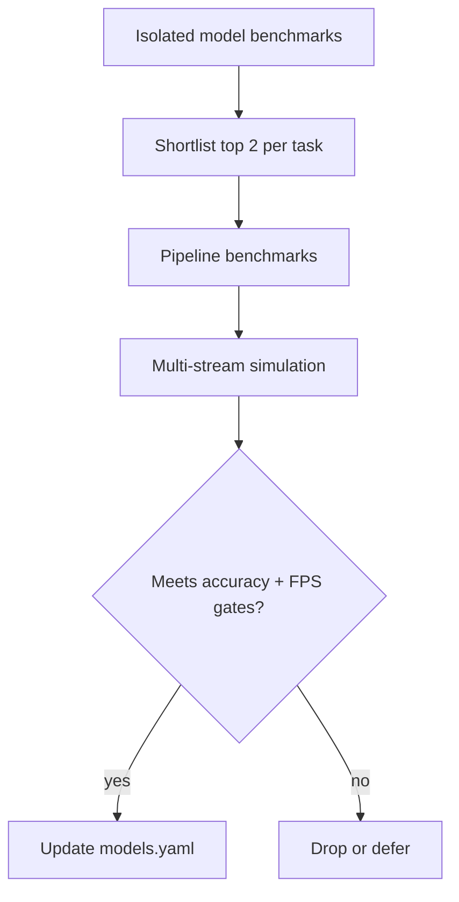

# Vision Service — Model & Pipeline Test Plan

Benchmark and selection plan for ReID, face detection/recognition, and end-to-end tracking pipelines used by [vision-service](PLAN.md). Results inform model choices in `models.yaml` and production ONNX/TensorRT export.

**Status:** Datasets and holdout splits are **TBD** — this document defines methodology, metrics, and model matrix now; data compilation is a separate workstream.

---

## Table of Contents

1. [Goals & Success Criteria](#1-goals--success-criteria)
2. [Test Environment](#2-test-environment)
   - [2.1 Benchmark host](#21-benchmark-host)
   - [2.2 Environment setup (Ubuntu + RTX 3090)](#22-environment-setup-ubuntu--rtx-3090)
3. [Datasets (TBD)](#3-datasets-tbd)
4. [Metrics](#4-metrics)
5. [ReID Embedding Models](#5-reid-embedding-models)
6. [System-Level Re-ID Approaches](#6-system-level-re-id-approaches)
7. [Face Detection Models](#7-face-detection-models)
8. [Face Embedding Models](#8-face-embedding-models)
9. [End-to-End Pipeline Tests](#9-end-to-end-pipeline-tests)
10. [Multi-Camera Throughput Simulation](#10-multi-camera-throughput-simulation)
11. [Reporting & Model Selection](#11-reporting--model-selection)
12. [Execution Phases](#12-execution-phases)

---

## 1. Goals & Success Criteria

### Primary goals

| Goal | Description |
|------|-------------|
| **Accuracy** | Rank models on domain-relevant identification and tracking quality |
| **Speed** | Measure single-frame and sustained throughput on the benchmark GPU |
| **Scale** | Simulate multiple camera feeds on one GPU to estimate streams-per-GPU |
| **Deployability** | Compare PyTorch, ONNX Runtime, and TensorRT (FP16 / INT8) parity |

### Production alignment (from [PLAN.md](PLAN.md))

Benchmarks run on **RTX 3090 24 GB** (§2.1). Results are interpreted against production targets on mid-tier GPUs:

| Constraint | Production target | Notes |
|------------|-------------------|-------|
| GPU class (deploy) | NVIDIA T4 or RTX 3060 class, 8 GB VRAM | Extrapolate from 3090 using streams/GPU and VRAM headroom |
| Per-stream FPS | 15–25 FPS @ 1080p (after decode) | Must hold on benchmark host at target `N` |
| Streams per GPU (deploy) | 4–8 (pipeline-dependent) | 3090 may sustain higher `N`; record max and scale estimate |
| Cross-camera ReId | Required | System-level approaches evaluated multi-camera |

### Selection rule (draft)

A model or pipeline is **production candidate** only if it meets:

1. Accuracy within **5% relative** of the best performer on the RapidEye holdout (once compiled), **and**
2. Sustained **≥ 15 FPS** per stream at **4 concurrent streams** on the **RTX 3090 benchmark host**, **and**
3. TensorRT INT8 (if used) accuracy drop **≤ 2%** vs FP32 on the same metric suite.

Thresholds are tunable after first benchmark pass. Document a **deployment scaling factor** (3090 → T4/3060) in each report.

---

## 2. Test Environment

All official benchmarks in this plan run on a **single dedicated host** unless noted otherwise.

### 2.1 Benchmark host

| Component | Specification |
|-----------|---------------|
| **GPU** | NVIDIA GeForce RTX 3090, 24 GB VRAM |
| **OS** | Ubuntu 22.04 LTS (64-bit) |
| **Role** | Sole reference machine for accuracy, latency, and multi-stream tests |
| **Persistence** | Fixed driver/CUDA/TensorRT versions per [§2.2](#22-environment-setup-ubuntu--rtx-3090); log `nvidia-smi`, kernel, and BIOS versions in every report |

Record the following in `benchmarks/results/<run_id>/config.yaml`:

- GPU name, driver, CUDA, cuDNN, TensorRT, Python, PyTorch, ONNX Runtime, FFmpeg versions
- CPU model, RAM, storage type (NVMe recommended for dataset I/O)
- Average GPU temperature and clock during sustained runs

### 2.2 Environment setup (Ubuntu + RTX 3090)

Complete these steps on a clean Ubuntu 22.04 install (or document deviations). Pin versions in `benchmarks/config/env.lock` after the first successful run.

#### Step 0 — Base system

```bash
sudo apt update && sudo apt upgrade -y
sudo apt install -y build-essential git curl wget ca-certificates \
  software-properties-common pkg-config cmake ninja-build \
  python3.11 python3.11-venv python3.11-dev \
  ffmpeg libavcodec-dev libavformat-dev libavutil-dev libswscale-dev \
  libglib2.0-0 libsm6 libxext6 libxrender-dev libgomp1 \
  pciutils nvtop htop tmux
```

Optional (recommended for reproducible GPU clocks during benchmarks):

```bash
sudo nvidia-smi -pm 1          # persistence mode
# Optional: lock application clocks (example — tune for 3090)
# sudo nvidia-smi -lgc 1395,1695
```

#### Step 1 — NVIDIA driver

Install a recent production driver (550+ series supports RTX 3090 on Ubuntu 22.04):

```bash
sudo apt install -y linux-headers-$(uname -r)
sudo add-apt-repository -y ppa:graphics-drivers/ppa
sudo apt update
sudo apt install -y nvidia-driver-550
sudo reboot
```

Verify after reboot:

```bash
nvidia-smi
# Expect: RTX 3090, 24576 MiB, driver >= 550
```

#### Step 2 — CUDA Toolkit 12.4

```bash
wget https://developer.download.nvidia.com/compute/cuda/repos/ubuntu2204/x86_64/cuda-keyring_1.1-1_all.deb
sudo dpkg -i cuda-keyring_1.1-1_all.deb
sudo apt update
sudo apt install -y cuda-toolkit-12-4
```

Add to `~/.bashrc`:

```bash
export CUDA_HOME=/usr/local/cuda-12.4
export PATH=$CUDA_HOME/bin:$PATH
export LD_LIBRARY_PATH=$CUDA_HOME/lib64:$LD_LIBRARY_PATH
```

Verify:

```bash
nvcc --version
# Expect: release 12.4
```

#### Step 3 — cuDNN 9 (for TensorRT / PyTorch)

Download **cuDNN 9.x for CUDA 12** from [NVIDIA cuDNN](https://developer.nvidia.com/cudnn) (requires login). Install the local `.deb` packages for Ubuntu 22.04, or use the tar archive:

```bash
# Example after extracting cudnn-*-archive:
sudo cp cudnn-*-archive/include/cudnn*.h /usr/local/cuda-12.4/include
sudo cp -P cudnn-*-archive/lib/libcudnn* /usr/local/cuda-12.4/lib64
sudo chmod a+r /usr/local/cuda-12.4/include/cudnn*.h /usr/local/cuda-12.4/lib64/libcudnn*
```

Verify libcudnn is on `LD_LIBRARY_PATH`.

#### Step 4 — TensorRT 10.x

Download **TensorRT 10.4+** for CUDA 12.x from [NVIDIA TensorRT](https://developer.nvidia.com/tensorrt). Install the Debian local repo package or extract the tar:

```bash
# Tar install example:
export TRT_ROOT=$HOME/TensorRT-10.4.0.26
export LD_LIBRARY_PATH=$TRT_ROOT/lib:$LD_LIBRARY_PATH
export PATH=$TRT_ROOT/bin:$PATH
```

Verify:

```bash
trtexec --version || python3 -c "import tensorrt; print(tensorrt.__version__)"
```

#### Step 5 — FFmpeg with NVDEC (hardware decode)

Use distro FFmpeg first; confirm NVDEC is available:

```bash
ffmpeg -hwaccels
# Expect: cuda, nvdec (or use -hwaccel cuda)
ffmpeg -decoders 2>/dev/null | grep -i cuvid
```

If NVDEC is missing, build FFmpeg with `--enable-cuda-nvcc --enable-libnpp` or install a CUDA-enabled build. Multi-stream tests (§10) **must** use the same decode path recorded in `config.yaml`.

#### Step 6 — Python virtual environment

From the RapidEye repo root:

```bash
cd /path/to/RapidEye/vision-service
python3.11 -m venv .venv-bench
source .venv-bench/bin/activate
pip install --upgrade pip wheel setuptools
```

#### Step 7 — PyTorch (CUDA 12.4)

```bash
pip install torch torchvision torchaudio --index-url https://download.pytorch.org/whl/cu124
python -c "import torch; print(torch.__version__, torch.cuda.is_available(), torch.cuda.get_device_name(0))"
# Expect: True, NVIDIA GeForce RTX 3090
```

#### Step 8 — ONNX Runtime GPU + export tooling

```bash
pip install onnx onnxruntime-gpu==1.19.2 onnxsim
python -c "import onnxruntime as ort; print(ort.get_device())"
# Expect: GPU
```

#### Step 9 — Benchmark dependencies

Create `vision-service/benchmarks/requirements-bench.txt` (when harness is implemented) with pinned versions, e.g.:

```
numpy<2
opencv-python-headless
pillow
pyyaml
pandas
matplotlib
tqdm
scikit-learn
pycocotools
filterpy              # SORT
lap                   # assignment
# torchreid / fastreid / insightface — add per model family
```

Install:

```bash
pip install -r benchmarks/requirements-bench.txt
```

Install **model-specific** packages as adapters are added (FastReID, ByteTrack, SCRFD, etc.). Record each in `env.lock`.

**Benchmark harness:** implementation lives in [`benchmarks/`](benchmarks/). See [`benchmarks/README.md`](benchmarks/README.md) for CLI usage, phases, and result visualization.

#### Step 10 — TensorRT Python bindings

```bash
pip install nvidia-tensorrt
# Or symlink/copy tensorrt whl from $TRT_ROOT/python/
```

#### Step 11 — Benchmark directory layout

```bash
mkdir -p benchmarks/{config,scripts,adapters,results,datasets}
touch benchmarks/config/env.lock
```

Expected layout:

```
vision-service/benchmarks/
  config/
    env.lock              # pinned versions from successful setup
    default.yaml          # input sizes, batch sizes, N-stream grid
  scripts/
    run_isolated.py
    run_pipeline.py
    run_multistream.py
    export_onnx.py
    build_trt.py
  adapters/               # one module per model family
  datasets/               # symlinks or manifests (RAPIDEYE-* when ready)
  results/<run_id>/
```

#### Step 12 — Sanity checks (gate before T0)

Run all checks; save output to `benchmarks/results/setup-verify/`:

```bash
# GPU
nvidia-smi -q | head -40

# PyTorch matmul on GPU
python -c "
import torch, time
x = torch.randn(4096, 4096, device='cuda')
torch.cuda.synchronize()
t0 = time.perf_counter()
for _ in range(100): x @ x
torch.cuda.synchronize()
print('matmul_100x_ms', (time.perf_counter()-t0)*1000)
"

# ONNX Runtime providers
python -c "import onnxruntime as ort; print(ort.get_available_providers())"

# FFmpeg decode smoke (replace with a short H.264 clip)
# ffmpeg -hwaccel cuda -i sample.mp4 -f null -

# Disk write speed (datasets should be on NVMe)
# dd if=/dev/zero of=benchmarks/datasets/.write_test bs=1G count=4 oflag=direct
```

#### Step 13 — Reproducibility settings

- Set `CUDA_MODULE_LOADING=LAZY` only if startup time matters; otherwise default.
- Export `OMP_NUM_THREADS=1` during latency micro-benchmarks to reduce variance.
- Set seeds in harness: `random`, `numpy`, `torch` (`torch.manual_seed`, `torch.cuda.manual_seed_all`).
- Disable unrelated GPU consumers (desktop compositor optional for headless).
- Run sustained tests for **≥ 5 minutes** after GPU warmup (100 iterations).

### 2.3 Software stack summary

| Component | Target version (initial pin) |
|-----------|----------------------------|
| OS | Ubuntu 22.04 LTS |
| NVIDIA driver | 550.x |
| CUDA | 12.4 |
| cuDNN | 9.x |
| TensorRT | 10.4+ |
| Python | 3.11 |
| PyTorch | 2.4.x + cu124 |
| ONNX Runtime GPU | 1.19.x |
| FFmpeg | 4.4+ with NVDEC |
| Decode (benchmarks) | NVDEC via FFmpeg (match production path) |

### 2.4 Inference backends per model

Each model is evaluated under every applicable backend:

| Backend ID | Description |
|------------|-------------|
| `pytorch` | Native checkpoint, FP32 |
| `onnx` | ONNX Runtime GPU, FP32 |
| `trt_fp16` | TensorRT engine, FP16 |
| `trt_int8` | TensorRT engine, INT8 (calibration set from train split of TBD dataset) |

Skip combinations that fail export or crash; record as `N/A` with reason.

### 2.5 Reproducibility

- Fixed random seeds for any sampling or calibration.
- Pin commit hash of benchmark scripts.
- Store raw JSON results under `vision-service/benchmarks/results/<run_id>/`.
- Log GPU clocks (disable boost drift for cross-run compare, or log average clock).

---

## 3. Datasets (TBD)

Datasets will be compiled later. Reserve the following **splits and roles** now so benchmarks remain comparable when data arrives.

### 3.1 Planned dataset slots

| ID | Modality | Purpose | Status |
|----|----------|---------|--------|
| `RAPIDEYE-REID` | Person crops + camera IDs | In-domain body ReID accuracy + cross-camera gallery/probe | **TBD** |
| `RAPIDEYE-FACE` | Face crops + identity labels | In-domain face verification / identification | **TBD** |
| `RAPIDEYE-STREAM` | Multi-camera video clips (1080p, ≥20 FPS source) | End-to-end pipeline + multi-stream throughput | **TBD** |
| `RAPIDEYE-CALIB` | Representative subset | TensorRT INT8 calibration only | **TBD** |

### 3.2 Public benchmarks (optional sanity check)

Run once per model family to validate harness before RapidEye data exists:

| Task | Dataset | Use |
|------|---------|-----|
| Body ReID | Market-1501, DukeMTMC-ReID | mAP, Rank-1 |
| Multi-camera tracking | MOT17 / MOT20 (person) | MOTA, IDF1, ID switches |
| Face verification | LFW, CF-PW | TAR @ FAR 1e-4 |
| Face identification | IJB-C (optional) | TAR @ FAR |

Public sets do **not** replace `RAPIDEYE-*` for final selection.

### 3.3 Dataset requirements (for compilation)

**`RAPIDEYE-REID`**

- Person bounding boxes (or full-body crops) with `camera_id`, `timestamp`, `person_id` (within clip) and `global_id` (cross-camera when known).
- Gallery / probe split: enrolled identities vs query appearances.
- Scenes: indoor, outdoor, day, night, occlusion.

**`RAPIDEYE-FACE`**

- Face boxes with `identity_id`; multiple poses per identity.
- Held-out identities for open-set evaluation.
- Match enrollment protocol in [PLAN.md §6](PLAN.md) (multiple images per identity).

**`RAPIDEYE-STREAM`**

- Synchronized or loosely aligned multi-camera sequences.
- 10–60 s clips minimum; variable crowd density.
- Ground truth: local track IDs + cross-camera `global_id` where available.
- Codec: H.264/H.265 encoded files to exercise decode + infer path.

---

## 4. Metrics

### 4.1 Accuracy — ReID embeddings (isolated)

| Metric | Definition |
|--------|------------|
| mAP | Mean average precision (CMC / re-ranking off unless noted) |
| Rank-1 / Rank-5 | Cumulative matching characteristic |
| mINP | Mean inverse negative penalty (optional) |

Report per-dataset and per-camera (same-camera vs cross-camera probe).

### 4.2 Accuracy — Face detection (isolated)

| Metric | Definition |
|--------|------------|
| Precision / Recall | At fixed confidence thresholds (0.5, 0.6, 0.7) |
| mAP | IoU 0.5:0.95 if COCO-style labels exist |
| FPPI | False positives per image on negative backgrounds |

### 4.3 Accuracy — Face embeddings (isolated)

| Metric | Definition |
|--------|------------|
| TAR @ FAR | True accept rate at false accept rate 1e-4, 1e-3 |
| EER | Equal error rate |
| Rank-1 | Closed-set identification on probe/gallery split |

### 4.4 Accuracy — Tracking & system-level ReID

| Metric | Definition |
|--------|------------|
| MOTA | Multiple object tracking accuracy |
| IDF1 | ID F1 (identity-aware) |
| ID switches | Count per sequence |
| IDF1 (cross-camera) | Identity consistency across cameras |
| Fragmentation | MT / PT / ML (MOTChallenge) |

For [MICRO-TRACK](https://arxiv.org/html/2409.03879v1) and [9th AI City Challenge](https://arxiv.org/html/2508.13564v1) approaches, report paper-aligned metrics where applicable (see §6).

### 4.5 Speed — single model

| Metric | Definition |
|--------|------------|
| Latency p50 / p95 / p99 | ms per inference (batch=1, typical input size) |
| Throughput | Inferences/sec at batch 1, 4, 8, 16 |
| VRAM peak | MB during steady-state inference |
| Engine build time | TensorRT compile time (one-time cost) |

**Input sizes (defaults)**

| Model type | Input |
|------------|-------|
| Body ReID | 256×128 |
| Face detection | 640×640 (letterbox) |
| Face embedding | 112×112 aligned face |

### 4.6 Speed — pipeline & multi-stream

| Metric | Definition |
|--------|------------|
| End-to-end latency | Decode → detect → embed → track (p95 ms per frame) |
| Achieved FPS | Per stream and aggregate |
| Frame drop rate | % frames skipped under load |
| Streams at 15 FPS | Max concurrent streams sustaining ≥ 15 FPS |
| Streams at 20 FPS | Max concurrent streams sustaining ≥ 20 FPS |

---

## 5. ReID Embedding Models

### 5.1 Model matrix

| ID | Model | Backends | Notes |
|----|-------|----------|-------|
| `reid-osnet-pt` | OSNet (e.g. `osnet_x1_0`) | pytorch, onnx, trt_fp16, trt_int8 | Primary candidate in PLAN.md |
| `reid-fastreid-pt` | FastReID (ResNet-50 / OSNet backbone per config) | pytorch, onnx, trt_fp16, trt_int8 | Higher accuracy, heavier |

Use the **same pretrained checkpoint family** across backends; document checkpoint URL and hash.

### 5.2 Isolated embedding benchmark

**Procedure**

1. Crop person images from `RAPIDEYE-REID` (or Market-1501 until TBD).
2. Extract L2-normalized embeddings per backend.
3. Compute pairwise cosine distance; evaluate gallery/probe split.
4. Sweep distance threshold; plot CMC and ROC.
5. Repeat for **same-camera** and **cross-camera** probe settings.

**TensorRT INT8**

- Calibration: 500–2000 crops from `RAPIDEYE-CALIB` (or train split).
- Report FP32 vs INT8 mAP and Rank-1 delta.

### 5.3 Speed benchmark

- Warmup 100 iterations; measure 1000 iterations batch=1.
- Report p50/p95/p99 latency and throughput on **RTX 3090 24 GB**.

---

## 6. System-Level Re-ID Approaches

Evaluate full systems (not single checkpoints) that implement detection, association, and cross-camera identity linking.

| ID | Approach | Reference | Evaluation focus |
|----|----------|-----------|------------------|
| `sys-micro-track` | MICRO-TRACK | [arXiv:2409.03879](https://arxiv.org/html/2409.03879v1) | Multi-camera track continuity, micro-track linking |
| `sys-aicity9` | 9th AI City Challenge method | [arXiv:2508.13564](https://arxiv.org/html/2508.13564v1) | Challenge-style multi-camera ReID / tracking |

### 6.1 Test protocol

1. **Reproduce** authors' inference pipeline (or official release) with pinned dependencies.
2. Run on `RAPIDEYE-STREAM` multi-camera sequences (and public AI City / MOT-derived sets if license permits).
3. Report system metrics (§4.4) plus any metrics defined in the papers.
4. Measure **end-to-end wall time** per frame including all stages (not model-forward only).
5. Document operational constraints (GPU count, batch rules, external detector dependency).

### 6.2 Comparison baseline

Run the same sequences through the **in-house stack** (§9) using best isolated ReID model from §5 for apples-to-apples on `RAPIDEYE-STREAM`.

### 6.3 Integration notes

Results inform whether to adopt components (e.g. linking strategy) vs full replacement of vision-service ReId module ([PLAN.md §5](PLAN.md)).

---

## 7. Face Detection Models

### 7.1 Model matrix

| ID | Model | Backends |
|----|-------|----------|
| `face-det-scrfd` | SCRFD | pytorch, onnx, trt_fp16, trt_int8 |
| `face-det-yolov5face` | YOLOv5-face | pytorch, onnx, trt_fp16, trt_int8 |

For **Light Face Network (LFN)** detection stages or unified inference, see [§8.4](#84-light-face-network-lfn--unified-detection--recognition).

### 7.2 Isolated detection benchmark

**Procedure**

1. Run detector on `RAPIDEYE-FACE` (or WIDER FACE until TBD).
2. NMS IoU 0.4; sweep confidence 0.3–0.7.
3. Match predictions to GT with IoU ≥ 0.5.
4. Report precision-recall curves and mAP.

**Speed**

- Input 640×640; batch=1 and batch=8 (multiple faces per batch if supported).
- Include **faces per frame** distribution from dataset (affects amortized cost in pipeline).

---

## 8. Face Embedding Models

### 8.1 Model matrix

| ID | Model | Loss / family | Backends |
|----|-------|---------------|----------|
| `face-emb-cosface` | CosFace | CosFace | pytorch, onnx, trt_fp16, trt_int8 |
| `face-emb-magface` | MagFace | MagFace | pytorch, onnx, trt_fp16, trt_int8 |
| `face-emb-adaface` | AdaFace | AdaFace | pytorch, onnx, trt_fp16, trt_int8 |
| `face-emb-elasticface` | ElasticFace | ElasticFace | pytorch, onnx, trt_fp16, trt_int8 |
| `face-emb-mobileface` | MobileFace | Mobile architectures | pytorch, onnx, trt_fp16, trt_int8 |
| `face-emb-edgeface` | EdgeFace | Edge-optimized | pytorch, onnx, trt_fp16, trt_int8 |
| `face-emb-pocketnet` | PocketNet | Lightweight | pytorch, onnx, trt_fp16, trt_int8 |
| `face-emb-mixfacenet` | MixFaceNet | Lightweight | pytorch, onnx, trt_fp16, trt_int8 |
| `face-emb-shufflefacenet` | ShuffleFaceNet | Lightweight | pytorch, onnx, trt_fp16, trt_int8 |

**Fair comparison rule:** Use each model's **recommended aligned crop** (112×112 unless checkpoint specifies otherwise). For detection-dependent tests (§9), pair every embedding model with **each** detector (SCRFD, YOLOv5-face) — report best detector×embedding pairs.

### 8.2 Isolated embedding benchmark

1. Use GT-aligned faces from `RAPIDEYE-FACE` for pure embedding compare (removes detector variance).
2. L2-normalize embeddings; cosine similarity.
3. Report TAR @ FAR 1e-4, EER, Rank-1 (closed-set).
4. Open-set: reject unknown identities; report FNMR @ FMR operating points.

### 8.3 Speed benchmark

- Batch=1 (single face per access-camera frame) and batch=16 (crowd scene).
- Lightweight models (MobileFace, EdgeFace, PocketNet, MixFaceNet, ShuffleFaceNet, **LFN**) expected to win on latency; verify accuracy tradeoff.

### 8.4 Light Face Network (LFN) — unified detection + recognition

Unified lightweight face **detection and recognition** architecture from:

> *Real-time face recognition algorithm based on lightweight neural network in the field of computer vision* — **Light Face Network (LFN)**  
> Discover Applied Sciences (2025). [DOI 10.1007/s42452-025-08004-y](https://link.springer.com/article/10.1007/s42452-025-08004-y)

**Architecture highlights (paper):** depthwise separable convolutions, channel-attention mechanisms, feature-compression / pruning-friendly design; targets embedded and mobile deployment with high accuracy on LFW and AgeDB.

| ID | Scope | Backends | Notes |
|----|-------|----------|-------|
| `face-lfn-unified` | Detection + alignment + embedding (end-to-end) | pytorch, onnx, trt_fp16, trt_int8 | Primary evaluation mode |
| `face-lfn-det` | Detection head only (if separable from release) | pytorch, onnx, trt_fp16, trt_int8 | Compare vs SCRFD / YOLOv5-face |
| `face-lfn-emb` | Embedding head only (on GT-aligned crops) | pytorch, onnx, trt_fp16, trt_int8 | Fair compare vs §8.1 |

**Implementation notes**

- Authors reference **Darknet** and Ubuntu in the paper; prefer a **PyTorch reimplementation or official weights** for the benchmark harness. If only Darknet weights exist, wrap via ONNX export and document any ops mismatch.
- Report **parameters, FLOPs, and VRAM** — LFN is a candidate for edge deployment if accuracy is competitive.
- Paper reports occlusion robustness (sunglasses, scarf); include those subsets in `RAPIDEYE-FACE` when compiled.

**Isolated accuracy**

| Mode | Metrics |
|------|---------|
| Unified (`face-lfn-unified`) | Detection mAP + TAR@FAR / Rank-1 on same pass |
| Det-only | §7.2 detection metrics |
| Emb-only (GT crops) | §8.2 embedding metrics |

**Isolated speed**

- Unified forward pass on full frame (det + rec in one graph) vs sum of separate SCRFD + embedding (pipeline overhead comparison).

---

## 9. End-to-End Pipeline Tests

### 9.1 Body ReID pipelines

**Topology:** `person detector` → `ReID embedder` → `tracker`

| Pipeline ID | Detector | Embedder | Tracker |
|-------------|----------|----------|---------|
| `pipe-body-01` | YOLOv11m (person) | OSNet | ByteTrack |
| `pipe-body-02` | YOLOv11m (person) | OSNet | BoTSORT |
| `pipe-body-03` | YOLOv11m (person) | OSNet | SORT |
| `pipe-body-04` | YOLOv11m (person) | FastReID | ByteTrack |
| `pipe-body-05` | YOLOv11m (person) | FastReID | BoTSORT |
| `pipe-body-06` | YOLOv11m (person) | FastReID | SORT |

For each pipeline, run all deployable backend combos (detector + embedder TensorRT variants). Tracker runs on CPU/GPU per reference implementation — record where.

**Optional appearance-off baseline:** ByteTrack / SORT without embedder (motion+IoU only) to quantify ReID contribution.

### 9.2 Face pipelines

**Topology:** `face detector` → `face embedder` → `tracker`

| Pipeline ID | Detector | Embedder | Tracker |
|-------------|----------|----------|---------|
| `pipe-face-*` | SCRFD **or** YOLOv5-face | Each model in §8.1 (18 combinations) | ByteTrack |
| `pipe-face-lfn-01` | **LFN (unified)** | *(internal)* | ByteTrack |
| `pipe-face-lfn-02` | **LFN (unified)** | *(internal)* | BoTSORT |
| `pipe-face-lfn-03` | **LFN (unified)** | *(internal)* | SORT |
| `pipe-face-lfn-04` | SCRFD or YOLOv5-face (best from §7) | **LFN emb-only** (if separable) | ByteTrack |
| `pipe-face-track-02` | Best detector from §7 | Best embedder from §8 | BoTSORT |
| `pipe-face-track-03` | Best detector from §7 | Best embedder from §8 | SORT |

Phase 1: all 18 detector×embedding pairs with **ByteTrack** only, plus **`pipe-face-lfn-01..03`** (unified LFN).  
Phase 2: top 3 pairs × {ByteTrack, BoTSORT, SORT}, plus LFN unified if it ranks in top 3.

**Face tracking note:** Associate face detections across frames by bbox IoU + embedding similarity (same weights philosophy as [PLAN.md §4](PLAN.md)).

### 9.3 Pipeline accuracy protocol

1. Input: `RAPIDEYE-STREAM` sequences with GT tracks and identities.
2. Run pipeline frame-by-frame (no skipping unless testing load mode).
3. Compute MOTA, IDF1, ID switches (§4.4).
4. **Recognition path:** gallery enroll N identities from training split; report identification accuracy on probe frames (links to [PLAN.md §6](PLAN.md)).
5. Log per-stage timings to attribute bottlenecks.

### 9.4 Pipeline speed protocol

- Single stream: 1080p decoded frames, measure sustained FPS for 5 min.
- Record GPU utilization, VRAM, CPU decode load.
- Compare `pytorch` end-to-end vs full `trt_fp16` / `trt_int8` pipeline.

---

## 10. Multi-Camera Throughput Simulation

Simulates production load: multiple independent camera feeds on **one GPU**, matching [PLAN.md](PLAN.md) worker design.

### 10.1 Feed simulation

| Parameter | Values |
|-----------|--------|
| Concurrent streams `N` | 1, 2, 4, 6, 8, 10, 12, 16, 20, 24 |
| Resolution | 1920×1080 |
| Target camera FPS | 20 (source video or duplicated loop) |
| Decode | NVDEC via FFmpeg on RTX 3090 — include in timing |
| Stream sources | Distinct clips from `RAPIDEYE-STREAM` (loop if shorter than test duration) |

**Scheduler models** (config `multistream.mode` or `--mode`):

| Mode | Behavior |
|------|----------|
| `round_robin` | One shared model; one frame per inference (`batch=1`). Default. |
| `batched_queue` | One shared model; frames enqueued per stream, flushed when `max_batch_size` or `flush_timeout_ms` is reached. |

**Round-robin** (`round_robin`): frame processing rotates across streams with batch=1 inference.

**Batched queue** (`batched_queue`): matches production worker design — single model weights, dynamic batching via `multistream.batching` in `config/default.yaml`:

```yaml
batching:
  max_batch_size: 8
  flush_timeout_ms: 15
  max_queue_depth: 64
```

Results include `scheduler_mode` and `batching` stats (`mean_batch_size`, `p95_batch_size`, queue depth).

### 10.2 Test matrix

Run each **production candidate pipeline** (§9) at each `N`:

| Measurement | Pass condition (draft) |
|-------------|------------------------|
| Achieved FPS per stream | Report; flag if any stream < 15 FPS |
| p95 end-to-end latency | Report; flag if > 500 ms |
| Frame drop rate | Report; flag if > 5% at target N |
| Max `N` at ≥ 15 FPS | Primary capacity metric |

### 10.3 Degraded modes (optional)

Repeat at `N = 8` with:

- `SLOW_DOWN` simulation: artificial 50 ms extra sleep per frame on random streams.
- Keyframe-only decode under load (match ingestion backpressure behavior).

### 10.4 gRPC ingress (integration phase)

After isolated GPU sim stabilizes:

- Replay encoded H.264 chunks via `VideoIngress.StreamVideo` ([PLAN.md](PLAN.md)) instead of local decode.
- Compare overhead vs raw decode-in-worker baseline.

---

## 11. Reporting & Model Selection

### 11.1 Result artifact

Each run produces:

```
benchmarks/results/<run_id>/
  config.yaml           # hardware, versions, git sha
  models/               # per-model JSON
  pipelines/            # per-pipeline JSON
  multistream/          # N-stream sweep JSON
  summary.md            # human-readable leaderboard
  plots/                # CMC, PR, latency histograms
```

### 11.2 Leaderboard tables (summary.md)

**ReID embeddings**

| Model | Backend | mAP (cross-cam) | Rank-1 | p95 latency (ms) | VRAM (MB) |

**Face detector × embedder**

| Detector | Embedder | TAR@FAR1e-4 | mAP det | p95 pipeline (ms) |

**Unified face (LFN)**

| Model | Backend | Det mAP | TAR@FAR1e-4 | Unified p95 (ms) | VRAM (MB) |

**Pipelines**

| Pipeline | MOTA | IDF1 | Streams@15FPS | Streams@20FPS | Notes |

### 11.3 Selection workflow



1. Drop models that fail minimum accuracy on `RAPIDEYE-*` (once available).
2. Drop backends where INT8 degradation exceeds gate (§1).
3. Prefer highest `Streams@15FPS` among remaining.
4. Document final pick in `models.yaml` with benchmark `run_id` reference.

---

## 12. Execution Phases

| Phase | Scope | Depends on |
|-------|-------|------------|
| **T0** | Harness + public sanity sets (Market-1501, WIDER FACE, LFW) | Nothing |
| **T1** | Isolated ReID + face model matrix (all backends), including **LFN** (§8.4) | T0 |
| **T2** | End-to-end pipelines (§9) | T1 shortlist |
| **T3** | Multi-stream simulation (§10) | T2 |
| **T4** | MICRO-TRACK + AI City systems (§6) | `RAPIDEYE-STREAM` |
| **T5** | Full evaluation on compiled `RAPIDEYE-*` datasets | Dataset compilation |
| **T6** | gRPC ingress integration test | ingestion-service stub |

---

## Appendix A: Model checklist

Use this checklist when adding a new candidate model.

- [ ] Checkpoint pinned and checksum recorded
- [ ] Export to ONNX succeeds
- [ ] TensorRT FP16 engine builds
- [ ] TensorRT INT8 engine builds with calibration set
- [ ] Numerical parity spot-check (FP32 vs TRT, cosine Δ < 0.01 on 100 crops)
- [ ] Isolated accuracy run
- [ ] Isolated speed run
- [ ] Pipeline integration run
- [ ] Multi-stream run at N ∈ {4, 8, 16} on RTX 3090

## Appendix B: Related documents

| Document | Relationship |
|----------|--------------|
| [PLAN.md](PLAN.md) | Production architecture, default models, FPS budgets |
| [ingestion-service/PLAN.md](../ingestion-service/PLAN.md) | Encoded video ingress (T6 integration) |

## Appendix C: LFN reference

| Field | Value |
|-------|-------|
| Name | Light Face Network (LFN) |
| Paper | [s42452-025-08004-y](https://link.springer.com/article/10.1007/s42452-025-08004-y) |
| Task | Unified face detection + recognition (lightweight) |
| Benchmark IDs | `face-lfn-unified`, `face-lfn-det`, `face-lfn-emb`, `pipe-face-lfn-*` |
| Paper datasets | LFW, AgeDB (use as sanity until `RAPIDEYE-FACE` exists) |
